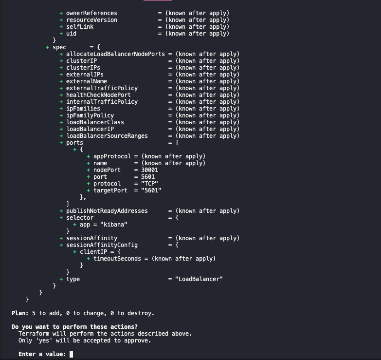
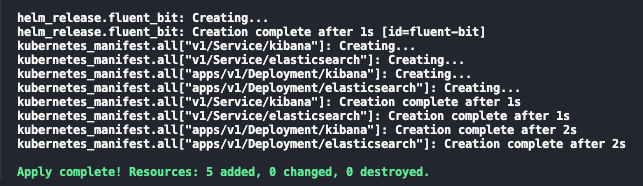
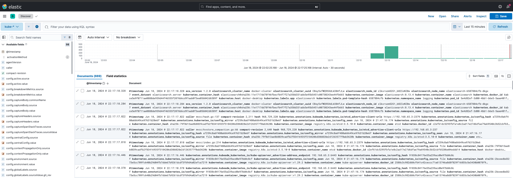

I've been struggling to wrap my head around fluentbit configs, and as with EKS I needed a way to quickly experiment and confirm my assumptions. A bonus if it was also reproducible.

I'm mostly using it to collect kubernetes logs, so my local lab is a kubernetes one. I'm also experienced in Terraform, so it  made sense to use it to spin up the lab. This brings us to our [Pre requisites](#pre-requisites).

## Pre requisites

1. A kubernetes local cluster
2. Terraform
3. kubectl

Item 1 has many options, in my case I'm using the local cluster provided by [Docker Desktop](https://docs.docker.com/desktop). Other options include [minikube](https://minikube.sigs.k8s.io/docs/), [kind](https://kind.sigs.k8s.io/), [k3s](https://k3s-io.github.io/), etc.

You can install Item 2 from the [official website](https://www.terraform.io/downloads.html). The same goes for [Item 3](https://kubernetes.io/docs/tasks/tools/).

With the above in place, we can proceed to the next section.

## Running the lab

Before digging into the code, let's take a look at how it looks. To bootstrap it, clone the https://github.com/o-leolleo/a-kubernetes-local-lab repository and navigate to the `fluentbit` directory.

Then run the following commands (ensure the cluster is running):

```bash
# Ensure you are pointing to the correct cluster
# (docker-desktop in my case)
kubectl config current-context

# Initialize terraform
terraform init

# Plan and apply the changes upon confirmation
terraform apply
```

The apply should show an output similar to the following:

[](terraform-plan.png)

and the below after confirmation:

[](terraform-apply.png)

Once finished you should be able navigate to the Kibana installation at [http://localhost:5601](http://localhost:5601). Go ahead and click on the sandwich menu on the left corner and navigate to **Discover**. Click on **Create data view** and inform **Name** and **index-pattern** as `kube-*`[^1]. Click on **Save data view to Kibana** and you should see something similar to the below [^2]:

[^1]: The index patterns  `k*`, `ku*`, `kub*` would also work, we only send kubernetes logs to Elasticsearch.
[^2]: Realistically we could use terraform to create the index pattern, it's a good exercise in case you're curious about it. Maybe I'll update the code to include it in the future.

[](kibana-logs.png)

These are all the logs collected by fluentbit from the kubernetes cluster, feel free to give it a try and experiment with a bit!

We can also debug fluentbit by tailing its logs via:

```bash
kubectl logs -n logging -l app=fluent-bit -f
```

## The code

The code is discussed in parts, starting with the `main.tf` file. The full code is available at the [o-leolleo/a-kubernetes-local-lab](https://github.com/o-leolleo/a-kubernetes-local-lab) repository.

### main.tf

We start by defining our required providers and instantiating them.

```terraform
terraform {
  required_providers {
    kubernetes = {
      source  = "hashicorp/kubernetes"
      version = "~> 2.30" #1
    }
  }
}

provider "helm" {
  kubernetes {
    config_path    = "~/.kube/config" #2
    config_context = "docker-desktop" #3
  }
}

provider "kubernetes" {
  config_path    = "~/.kube/config"
  config_context = "docker-desktop"
}
```

1. Required version for the kubernetes provider (`version >= 2.30 and version < 3`), see more at [Version Constraints](https://developer.hashicorp.com/terraform/language/expressions/version-constraints)
2. Path to our kubeconfig file
3. Context to use (preferably a local one)

Here, targeting a remote cluster would be just a matter of changing the `config_context`, assuming the remote cluster is already configured in your [kubeconfig](https://kubernetes.io/docs/concepts/configuration/organize-cluster-access-kubeconfig/) file and accessible.

We then proceed to declare the fluentbit helm installation via the Terraform [`helm_release`](https://registry.terraform.io/providers/hashicorp/helm/latest/docs/resources/release) resource.

```terraform
resource "helm_release" "fluent_bit" {
  name             = "fluent-bit" #1
  repository       = "https://fluent.github.io/helm-charts"
  chart            = "fluent-bit"
  namespace        = "logging"
  create_namespace = true

  values = [
    file("./values-files/fluent-bit.values.yaml") #2
  ]
}
```

1. Name of the helm release as it appears in the cluster
2. values file to be used for the helm release - we'll soon discuss it

The above will drive the same results as running the below.

```bash
helm repo add fluent https://fluent.github.io/helm-charts

helm install \
  fluent-bit \
  fluent/fluent-bit \
  --namespace logging \
  --values ./values-files/fluent-bit.values.yaml
  --create-namespace
```

here `fluent-bit` is the name of the helm release and `fluent/fluent-bit` is the chart to be installed, the rest is as per the [Terraform resource](https://registry.terraform.io/providers/hashicorp/helm/latest/docs/resources/release).

<!-- TODO: Why `fluent/fluent-bit` but on terraform we specify `fluent-bit` only? -->

The rest of `main.tf` is dedicated to creating minimalist deployments for Elasticsearch and Kibana.

```terraform
resource "kubernetes_manifest" "all" {
  for_each = local.manifests #1

  manifest = each.value #2

  depends_on = [
    helm_release.fluent_bit #3
  ]
}

locals {
  manifests = {
    for m in local._manifests :
    "${m.apiVersion}/${m.kind}/${m.metadata.name}" => m #4
  }

  _manifests = flatten([
    for file in fileset("./manifests", "**.yaml") : #5
    provider::kubernetes::manifest_decode_multi( #7
      file("./manifests/${file}")
    )
  ])
}
```

Though small there is quite a bit happening here, let's break it down.

1. We iterate over the local variable `manifests` which holds each manifest object - as a [terraform object](https://developer.hashicorp.com/terraform/language/expressions/types#map) - declared on `.yaml` files inside the `manifests` folder
2. We assign the manifest object to the `manifest` attribute
3. We ensure that these manifests are only created _after_ the `fluent-bit` helm release is created, thus _after_ our log collector is in place
4. The `manifests` local variable is a map of the manifest objects, keyed by a combination of the `apiVersion`, `kind` and `metadata.name`. `_manifests` is a list of all the manifest objects
5. for each file in the `manifests` folder (and its subfolders)
6. decode the manifest file into a [terraform object](https://developer.hashicorp.com/terraform/language/expressions/types#map)

I've breaken down the `manifests` variable into two (one temporary one) to make the expression more readable [^3].

[^3]: In case you're curious, this would be equivalent as a single local var
    ```terraform
      manifests = {
        for m in flatten([
          for file in fileset("./manifests", "**.yaml") :
          provider::kubernetes::manifest_decode_multi(
            file("./manifests/${file}")
          )
        ]):
        "${m.apiVersion}/${m.kind}/${m.metadata.name}" => m
      }
    ```

In the next section we get into the fluentbit values file details.

I won't dig much into the Elasticsearch and Kibana deployments,
they're pretty standard and can be found at the [o-leolleo/a-kubernetes-local-lab//fluentbit/manifests](https://github.com/o-leolleo/a-kubernetes-local-lab/tree/main/fluentbit/manifests) repository folder.

### The fluentbit values file
