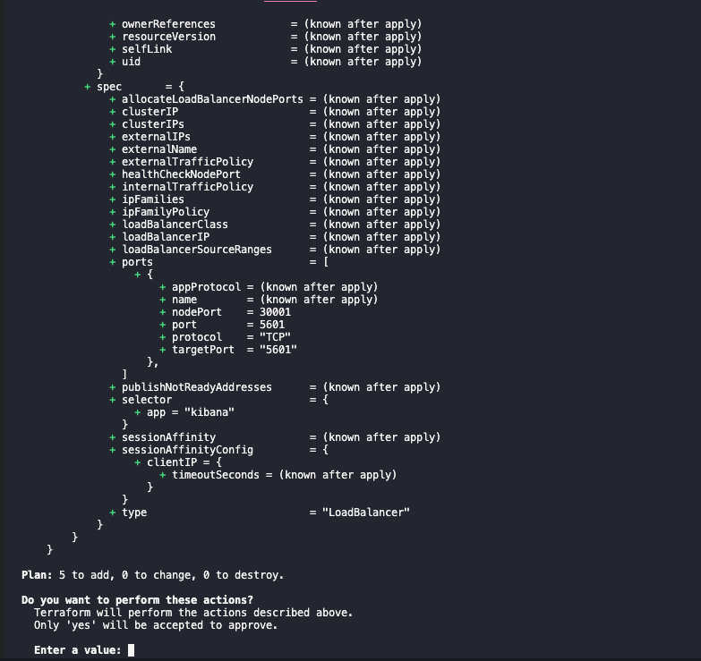
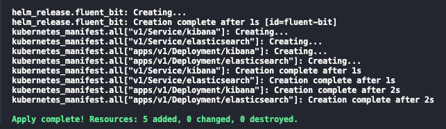
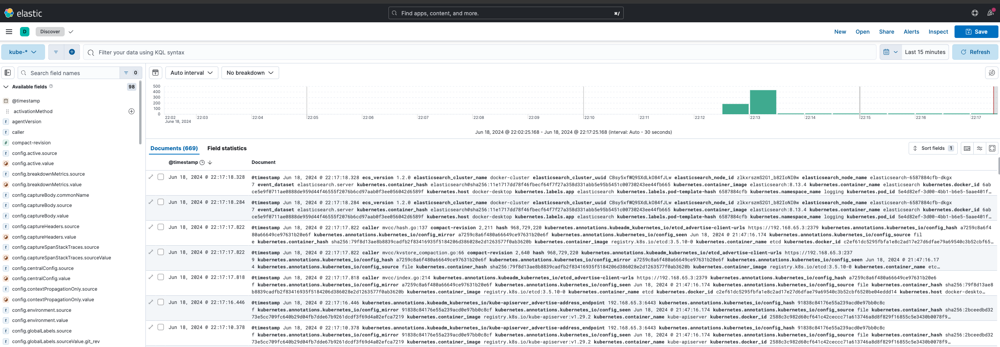

I've been struggling to wrap my head around fluentbit configs, and as with EKS I needed a way to quickly experiment and confirm my assumptions. A bonus if it was also reproducible.

I'm mostly using it to collect kubernetes logs, so my local lab is in a sense a kubernetes one. I'm also experienced in Terraform, so it would make sense to use it to spin up the lab. This brings us to our [Pre requisites](#pre-requisites).

## Pre requisites

1. A kubernetes local cluster
2. Terraform
3. kubectl

Item 1 has many options, in my case I'm using the local cluster provided by [Docker Desktop](https://docs.docker.com/desktop). Other options include [minikube](https://minikube.sigs.k8s.io/docs/), [kind](https://kind.sigs.k8s.io/), [k3s](https://k3s-io.github.io/), etc.

You can install Item 2 from the [official website](https://www.terraform.io/downloads.html). The same goes for [Item 3](https://kubernetes.io/docs/tasks/tools/).

With the above in place, we can proceed to the next section.

## Running the lab

Before digging into the code, let's take a look at how it looks. To bootstrap it, clone the https://github.com/o-leolleo/a-kubernetes-local-lab repository and navigate to the `fluentbit` directory.

Then run the following commands (ensure the cluster is running):

```bash
# Ensure you are pointing to the correct cluster
# (docker-desktop in my case)
kubectl config current-context

# Initialize terraform
terraform init

# Plan and apply the changes upon confirmation
terraform apply
```

The apply should show an output similar to the following:

[](terraform-plan.png)

and the below after confirmation:

[](terraform-apply.png)

With the above in place you can navigate to the [Kibana](http://localhost:5601) installation. Click on the sandwitch menu on the left corner and navigate to **Discover**. Click on **Create data view** and inform **Name** and **index-pattern** as `kube-*`. Click on **Save data view to Kibana** and you should see something similar to the below:

[](kibana-logs.png)

These are all logs collecated by fluentbit from the kubernetes cluster.
