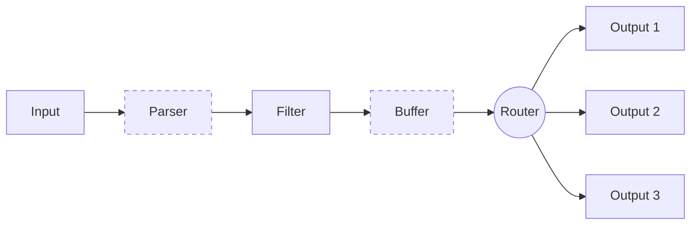

I've been struggling to wrap my head around fluentbit configs, and as with EKS I needed a way to quickly experiment and confirm my assumptions. A bonus if it was also reproducible.

I'm mostly using it to collect kubernetes logs, so my local lab is a kubernetes one. I'm also experienced in Terraform, so it  made sense to use it to spin up the lab. This brings us to our [Pre requisites](#pre-requisites).

## Pre requisites

1. A kubernetes local cluster
2. Terraform
3. kubectl

Item 1 has many options, in my case I'm using the local cluster provided by [Docker Desktop](https://docs.docker.com/desktop). Other options include [minikube](https://minikube.sigs.k8s.io/docs/), [kind](https://kind.sigs.k8s.io/), [k3s](https://k3s-io.github.io/), etc.

You can install Item 2 from the [official website](https://www.terraform.io/downloads.html). The same goes for [Item 3](https://kubernetes.io/docs/tasks/tools/).

With the above in place, we can proceed to the next section.

## Running the lab

Before digging into the code, let's take a look at how it looks. To bootstrap it, clone the https://github.com/o-leolleo/a-kubernetes-local-lab repository and navigate to the `fluentbit` directory.

Then run the following commands (ensure the cluster is running):

```bash
# Ensure you are pointing to the correct cluster
# (docker-desktop in my case)
kubectl config current-context

# Initialize terraform
terraform init

# Plan and apply the changes upon confirmation
terraform apply
```

The apply should show an output similar to the following:

[](terraform-plan.png)

and the below after confirmation:

[](terraform-apply.png)

Once finished you should be able navigate to the Kibana installation at [http://localhost:5601](http://localhost:5601). Go ahead and click on the sandwich menu on the left corner and navigate to **Discover**. Click on **Create data view** and inform **Name** and **index-pattern** as `kube-*`[^1]. Click on **Save data view to Kibana** and you should see something similar to the below [^2]:

[^1]: The index patterns  `k*`, `ku*`, `kub*` would also work, we're only sending kubernetes logs to Elasticsearch.
[^2]: Realistically we could use Terraform to create the index pattern, it's a good exercise in case you're curious about it. Maybe I'll update the code to include it in the future.

[](kibana-logs.png)

These are all the logs collected by fluentbit from the kubernetes cluster, feel free to give it a try and experiment with it a bit!

We can also debug fluentbit by tailing its logs via:

```bash
kubectl logs -n logging -l app=fluent-bit -f
```

## The code

I'm starting by discussing the `main.tf` file, then will proceed to the others, one by one. The code is fully available at the [o-leolleo/a-kubernetes-local-lab](https://github.com/o-leolleo/a-kubernetes-local-lab) repository.

### main.tf

We start by defining our required providers and instantiating them.

```terraform
terraform {
  required_providers {
    kubernetes = {
      source  = "hashicorp/kubernetes"
      version = "~> 2.30" #1
    }
  }
}

provider "helm" {
  kubernetes {
    config_path    = "~/.kube/config" #2
    config_context = "docker-desktop" #3
  }
}

provider "kubernetes" {
  config_path    = "~/.kube/config"
  config_context = "docker-desktop"
}
```

1. Required version for the kubernetes provider (`version >= 2.30 and version < 3`), see more at [Version Constraints](https://developer.hashicorp.com/terraform/language/expressions/version-constraints).
2. Path to our `kubeconfig` file.
3. Context to use (preferably a local one).

Here, targeting a remote cluster would be just a matter of changing the `config_context`, assuming the remote cluster is already configured in your [kubeconfig](https://kubernetes.io/docs/concepts/configuration/organize-cluster-access-kubeconfig/) file and accessible.

We then proceed to declare the fluentbit helm installation via the Terraform [`helm_release`](https://registry.terraform.io/providers/hashicorp/helm/latest/docs/resources/release) resource.

```terraform
resource "helm_release" "fluent_bit" {
  name             = "fluent-bit" #1
  repository       = "https://fluent.github.io/helm-charts"
  chart            = "fluent-bit"
  namespace        = "logging"
  create_namespace = true

  values = [
    file("./values-files/fluent-bit.values.yaml") #2
  ]
}
```

1. name of the helm release as it appears in the cluster
2. values file to be used for the helm release - we'll soon discuss it

The above code is equivalent to running the following plain helm commands.

```bash
# Add the helm repository, with the name fluent locally
# we don't need this step in terraform
helm repo add fluent https://fluent.github.io/helm-charts

helm install \
  fluent-bit \
  fluent/fluent-bit \
  --namespace logging \
  --values ./values-files/fluent-bit.values.yaml
  --create-namespace
```

Here, `fluent-bit` is the name of the helm release and `fluent/fluent-bit` (in the `<repository>/<chart>` format) is the chart to be installed, the rest is the same as in the [Terraform resource](https://registry.terraform.io/providers/hashicorp/helm/latest/docs/resources/release).

What's left of the `main.tf` file is dedicated to the creation of the Elasticsearch and Kibana minimalist deployments.

```terraform
resource "kubernetes_manifest" "all" {
  for_each = local.manifests #1

  manifest = each.value #2

  depends_on = [
    helm_release.fluent_bit #3
  ]
}

locals {
  manifests = {
    for m in local._manifests :
    "${m.apiVersion}/${m.kind}/${m.metadata.name}" => m #4
  }

  _manifests = flatten([
    for file in fileset("./manifests", "**.yaml") : #5
    provider::kubernetes::manifest_decode_multi( #7
      file("./manifests/${file}")
    )
  ])
}
```

Though small, there is quite a bit happening here, let's break it down.

1. We iterate over the local variable `manifests` which holds each manifest object - as a [terraform object](https://developer.hashicorp.com/terraform/language/expressions/types#map) - declared on `.yaml` files inside the `manifests` folder.
2. We assign the manifest object to the `manifest` attribute.
3. We ensure that these manifests are only created _after_ the `fluent-bit` helm release is created, thus _after_ our log collector is in place.
4. The `manifests` local variable is a map of the manifest objects, keyed by a combination of the `apiVersion`, `kind` and `metadata.name`. `_manifests` is a list of all the manifest objects.
5. for each file in the `manifests` folder (and its subfolders).
6. decode the manifest file into a [terraform object](https://developer.hashicorp.com/terraform/language/expressions/types#map).

I've broken down the `manifests` local variable into two (one intermediary one) to make the expression more readable [^3].

[^3]: In case you're curious, this would be equivalent as a single local var
    ```terraform
      manifests = {
        for m in flatten([
          for file in fileset("./manifests", "**.yaml") :
          provider::kubernetes::manifest_decode_multi(
            file("./manifests/${file}")
          )
        ]):
        "${m.apiVersion}/${m.kind}/${m.metadata.name}" => m
      }
    ```

I'm not detailing the Elasticsearch and Kibana deployments themselves,
they're pretty standard and can be found at the [o-leolleo/a-kubernetes-local-lab//fluentbit/manifests](https://github.com/o-leolleo/a-kubernetes-local-lab/tree/main/fluentbit/manifests) repository folder.

### The fluentbit configuration (values) file

In the configuration we specify, beside other things, the flow of a given log message across the fluentbit pipeline. This is detailed in the diagram below. The file is composed of sections corresponding to each of the stages of the pipeline, illustrated as boxes in the image. _We'll skip from our discussion the stages represented by dashed boxes_.



In the diagram:
- **Input** corresponds to our log sources: log files, systemd, etc.
- **Filter** is where we manipulate the log messages, removing or adding fields, skipping log entries, etc.
- **Output** specifies our processed logs destinations, for example Elasticsearch, Kafka, etc.

Since we're using helm to install fluentbit, we use a values file to pass our configuration. You can check the full list of available values [here](https://github.com/fluent/helm-charts/blob/main/charts/fluent-bit/values.yaml). Behind the scenes, each property of `config` is transformed into a section of the fluentbit configuration file.

The values file is detailed below.

```yaml
config:
  # 1
  service: |
    [SERVICE]
        Daemon Off
        Flush {{ .Values.flush }}
        Log_Level {{ .Values.logLevel }}
        Parsers_File /fluent-bit/etc/parsers.conf
        Parsers_File /fluent-bit/etc/conf/custom_parsers.conf
        HTTP_Server On
        HTTP_Listen 0.0.0.0
        HTTP_Port {{ .Values.metricsPort }}
        Health_Check On

  #2
  inputs: |
    [INPUT]
        Name tail
        Path /var/log/containers/*.log
        multiline.parser docker, cri
        Tag kube.*
        Mem_Buf_Limit 5MB
        Skip_Long_Lines On

    [INPUT]
        Name systemd
        Tag host.*
        Systemd_Filter _SYSTEMD_UNIT=kubelet.service
        Read_From_Tail On

  #3
  filters: |
    [FILTER]
        Name kubernetes
        Match kube.*
        Merge_Log On
        Keep_Log Off
        K8S-Logging.Parser On
        K8S-Logging.Exclude On

  #4
  outputs: |
    [OUTPUT]
        Name es
        Match kube.*
        Host elasticsearch
        Suppress_Type_Name On
        Logstash_Prefix kube
        Logstash_Format On
        Trace_Error On
        Retry_Limit False
        Replace_Dots On

    [OUTPUT]
        Name es
        Match host.*
        Host elasticsearch
        Suppress_Type_Name On
        Logstash_Format On
        Logstash_Prefix node
        Trace_Error On
        Retry_Limit False
        Replace_Dots On
```

Let's break it down:
1. The `service` section is where we define the global configuration of fluentbit, such as the log level, flush interval, etc. This section is not a part of the data flow diagram above. The `{{ .Values.flush }}` here and the like are handled by the helm template engine, and are replaced by the values informed on the `values.yaml` file, which have defaults defined by the helm chart. Notice that fluentbit also listens on a port for metrics, used by prometheus to scrape monitoring data.
2. As `inputs` we specify both containerd logs from the kubernetes containers and the host systemd logs.
3. Here we only use the kubernetes fluentbit built-in filter to parse the kubernetes logs.
4. Both `outputs` send the logs to the same elasticsearch instance, but we output them to different Elasticsearch indexes, informed via the `Logstash_Prefix` property. Notice how we _route_ the logs based on the `Match` property, this is effectively the router stage shown in the diagram above, and we route the logs based on the tags we've informed on our `inputs`.

The relationship of the tail log filter and the kubernetes logs is very well discussed in the [fluentbit documentation](https://docs.fluentbit.io/manual/pipeline/filters/kubernetes). I'm not discussing it in much detail here, but it's worth a read if you're interested. For this post purposes, it's enough to know that the `.*` on `Tag kube.*` gets replaced by the absolute path of the monitored file, with slashes replaced by dots. Also, quoting the documentation:

> When Kubernetes Filter runs, it will try to match all records that starts with `kube.` (note the ending dot), so records from the file mentioned above will hit the matching rule and the filter will try to enrich the records

This is also how we match the logs on the outputs section and it also explains how the `hosts.*` tagged logs are being handled, it's a similar mechanism taking place. For some reason I didn't get any `host.*` logs on my setup.

## A use case: splitting logs by type

Now let's suppose that, for some reason, you wanted to save different logs to different indexes based on an arbitrary log category or type. For example, you might want to log `kube-system` and `logging` namespace logs to `system-*` indexes, istio logs to `istio-*` indexes and all the rest to `workloads-*` indexes. Or maybe you want a different set of categories. We could work out a solution for this by slightly modifying our fluentbit configuration (You can see the full config [here](https://github.com/o-leolleo/a-kubernetes-local-lab/blob/main/fluentbit/values-files/fluent-bit-split-by-type.values.yaml)).

We can add two more filters on top of the `kubernetes` one:

```yaml
filters:
  # ...
  [FILTER]
      Name modify #1
      Match kube.* #2

      Condition Key_value_matches $kubernetes['namespace_name'] ^(kube-system|logging)$ #3

      Add log_type system #4


  [FILTER]
      Name modify
      Match kube.*

      Condition Key_value_matches $kubernetes['namespace_name'] ^istio-.*$ #5

      Add log_type ingress #6
```

Here it's what we're doing:

1. we instantiate the [`modify` filter](https://docs.fluentbit.io/manual/pipeline/filters/modify).
2. for every log record matching the `kube.*` tag (or all kubernetes logs).
3. if the `namespace_name` field matches `kube-system` or `logging`.
4. add a new field `log_type` with the value `system`.
5. else if the `namespace_name` field matches `istio-*`.
6. add a new field `log_type` with the value `ingress`.

With the above in place, we can slightly modify our `kube.*` elasticsearch output to:

```yaml
outputs:
  # ...
  [OUTPUT]
      Name es
      Match kube.*
      Host elasticsearch
      Suppress_Type_Name On
      Logstash_Prefix_Key $log_type #1
      Logstash_Prefix workloads #2
      Logstash_Format On
      Trace_Error On
      Retry_Limit False
      Replace_Dots On
```

Here we only added the `Logstash_Prefix_Key` [^4] property (1) and changed the `Logstash_Prefix` to `workloads` (2). Our logs will then be indexed as `$log_type-YYYY.MM.DD` if `$log_type` is not null, and `workloads-YYYY.MM.DD` otherwise.

[^4]: The fact that `Logstash_Prefix_Key` accepts a [record accessor](https://docs.fluentbit.io/manual/administration/configuring-fluent-bit/classic-mode/record-accessor) makes it very flexible, and avoids the need to create multiple outputs for each log type. In case you ever wanted to split logs by namespace, you could use `Logstash_Prefix_Key $kubernetes['namespace_name']` for example.

With this set, after applying the changes through a `terraform apply`, we get the result shown on the image below, where we can see each log type specific index.

[](logs-split-by-type.png)

Our indexes are in `yellow` state because we have only one Elasticsearch node (you can read more [here](https://stackoverflow.com/questions/60819814/what-does-it-mean-when-an-elasticsearch-index-has-yellow-health#:~:text=1%20common%20reason%20is%20if,indices%20would%20always%20be%20yellow.)).

## Conclusion

Here we discussed how to create a local kubernetes lab with fluentbit using Terraform, where we could explore and experiment with its configuration. We used minimal deployments of Elasticsearch and Kibana to visualize the logs collected, and we also discussed how to split the logs by type using fluentbit filters. The code has also been discussed and it has been made available at the [o-leolleo/a-kubernetes-local-lab](https://github.com/o-leolleo/a-kubernetes-local-lab/tree/main/fluentbit) repo.

The key here is that now we have a setup we can safely tweak and break, so as to test assumptions and get fast feedback.
Feel free to give it a try!
