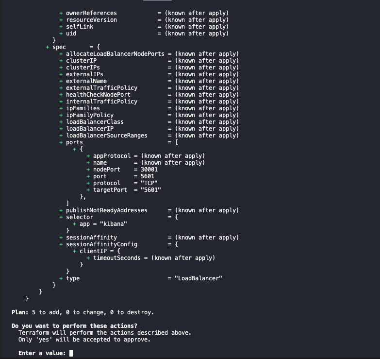
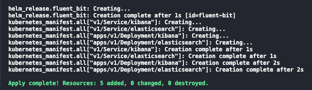
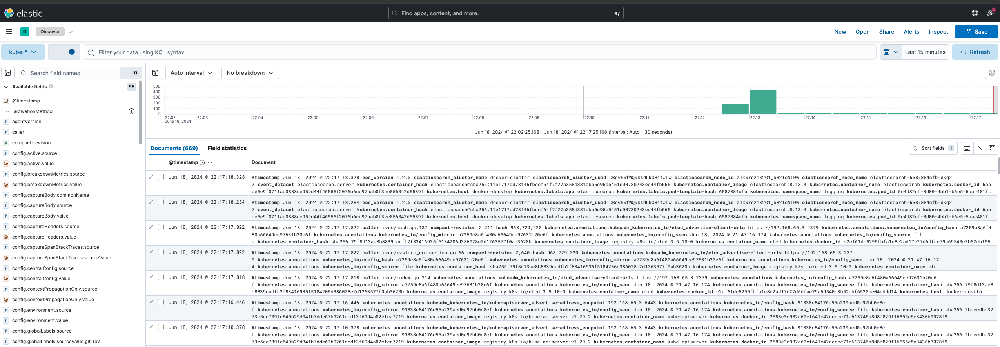
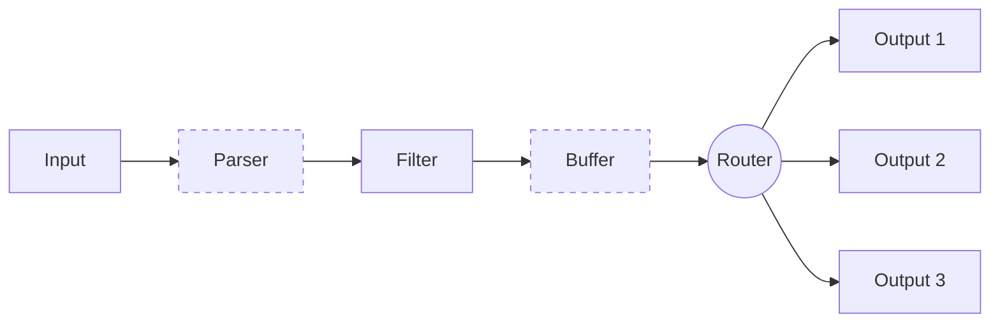
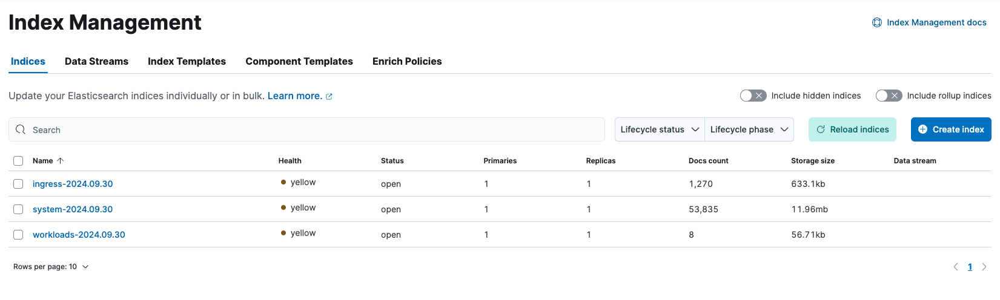

Tenho lutado para entender a configuração do fluentbit, e como com o EKS eu precisava de uma forma de experimentar e confirmar minhas suposições. Um bônus se também fosse reproduzível.

Costumo utilizá-lo para coletar logs do kubernetes, então meu lab local é um lab kubernetes. Também sou experiente em Terraform, de modo que usá-lo no lab foi uma escolha natural. Isso nos leva aos [Pré-requisitos](#pré-requisitos).

## Pré-requisitos

1. Um cluster kubernetes local
2. Terraform
3. kubectl

O Item 1 possui muitas opções, no meu caso estou usando o cluster local fornecido pelo [Docker Desktop](https://docs.docker.com/desktop). Outras opções incluem [minikube](https://minikube.sigs.k8s.io/docs/), [kind](https://kind.sigs.k8s.io/), [k3s](https://k3s-io.github.io/), etc.

Você pode instalar o Item 2 a partir do [site oficial](https://www.terraform.io/downloads.html). O mesmo vale para o [Item 3](https://kubernetes.io/docs/tasks/tools/).

Com os itens acima em mãos, podemos prosseguir para a próxima seção.

## Executando o lab

Antes de partirmos para o código, vejamos como ele se parece. Para isso, clone o repositório [https://github.com/o-leolleo/a-kubernetes-local-lab](https://github.com/o-leolleo/a-kubernetes-local-lab) e navegue até o diretório `fluentbit`.

Depois, execute os seguintes comandos (certifique-se de que o cluster está em execução):

```bash
# Certifique-se de que você está apontando para o cluster correto
# (docker-desktop no meu caso)
kubectl config current-context

# Inicialize o workspace do terraform
terraform init

# Plan e apply do terraform, uma vez confirmado que as mudanças são as esperadas
terraform apply
```

O _apply_ deve mostrar um output similar ao seguinte:

[](terraform-plan.png)

e o seguinte, após a confirmação:

[](terraform-apply.png)

Uma vez finalizado, você deve ser capaz de navegar até a instalação do Kibana em [http://localhost:5601](http://localhost:5601). Vá em frente, clique no menu sanduíche no canto superior esquerdo e navegue até **Discover**. Clique em **Create data view** e informe **Name** e **index-pattern** como `kube-*`[^1]. Clique em **Save data view to Kibana** e você deve ver algo similar ao abaixo [^2]:

[^1]: Os _index patterns_ `k*`, `ku*`, `kub*` também funcionariam, já que estamos enviando apenas _logs_ do kubernetes para o Elasticsearch.
[^2]: Realisticamente, poderíamos usar Terraform para criar o _index pattern_, trata-se de um bom exercício caso você esteja curioso sobre. Talvez eu atualize o código para incluir esse detalhe no futuro.

[](kibana-logs.png)

Esses são todos os _logs_ coletados pelo fluentbit do _cluster_ kubernetes, sinta-se à vontade para utilizá-lo e experimentar com ele um pouco!

Também podemos debugar o fluentbit seguindo os seus logs via:

```bash
kubectl logs -n logging -l app=fluent-bit -f
```

## O código

Decidi começar a discussão a partir do arquivo `main.tf`, procedo então para os outros, um por um. O código está inteiramente disponível no repositório [o-leolleo/a-kubernetes-local-lab](https://github.com/o-leolleo/a-kubernetes-local-lab).


### main.tf

Começamos definindo os nossos _providers_ necessários e instanciando-os.

```terraform
terraform {
  required_providers {
    kubernetes = {
      source  = "hashicorp/kubernetes"
      version = "~> 2.30" #1
    }
  }
}

provider "helm" {
  kubernetes {
    config_path    = "~/.kube/config" #2
    config_context = "docker-desktop" #3
  }
}

provider "kubernetes" {
  config_path    = "~/.kube/config"
  config_context = "docker-desktop"
}
```

1. Versão necessária para o _provider_ do kubernetes (`version >= 2.30 e version < 3`), veja mais em [Version Constraints](https://developer.hashicorp.com/terraform/language/expressions/version-constraints).
2. Caminho para o nosso arquivo de configuração kubeconfig.
3. _Context_ a ser utilizado (preferencialmente um local).

Aqui, realizar as mudanças em um _cluster_ remoto seria apenas uma questão de mudarmos o `config_context`, assumindo que o _cluster_ remoto já está configurado no seu arquivo [kubeconfig](https://kubernetes.io/docs/concepts/configuration/organize-cluster-access-kubeconfig/) e é acessível.

Procedemos então para a declaração da instalação do fluentbit via _resource_ [`helm_release`](https://registry.terraform.io/providers/hashicorp/helm/latest/docs/resources/release).

```terraform
resource "helm_release" "fluent_bit" {
  name             = "fluent-bit" #1
  repository       = "https://fluent.github.io/helm-charts"
  chart            = "fluent-bit"
  namespace        = "logging"
  create_namespace = true

  values = [
    file("./values-files/fluent-bit.values.yaml") #2
  ]
}
```

1. Nome da release do helm como aparece no cluster
2. Arquivo de valores a ser utilizado para a release do helm - discutiremos isso em breve

O código acima é equivalente a executar os seguintes comandos.

```bash
helm repo add fluent https://fluent.github.io/helm-charts

helm install \
  fluent-bit \
  fluent/fluent-bit \
  --namespace logging \
  --values ./values-files/fluent-bit.values.yaml
  --create-namespace
```

No exemplo, `fluent-bit` é o nome da release do helm e `fluent/fluent-bit` é o chart a ser instalado, o restante é o mesmo que o descrito na documentação do [resource do Terraform](https://registry.terraform.io/providers/hashicorp/helm/latest/docs/resources/release).

O que resta do arquivo `main.tf` é dedicado à criação de instalações minimalistas do Elasticsearch e do Kibana.

```terraform
resource "kubernetes_manifest" "all" {
  for_each = local.manifests #1

  manifest = each.value #2

  depends_on = [
    helm_release.fluent_bit #3
  ]
}

locals {
  manifests = {
    for m in local._manifests :
    "${m.apiVersion}/${m.kind}/${m.metadata.name}" => m #4
  }

  _manifests = flatten([
    for file in fileset("./manifests", "**.yaml") : #5
    provider::kubernetes::manifest_decode_multi( #7
      file("./manifests/${file}")
    )
  ])
}
```

Apesar de pequeno, há muita coisa acontecendo aqui, analisemos cada parte.

1. Iteramos sobre a variável local `manifests` que contém cada manifesto kubernetes como um [objeto do Terraform](https://developer.hashicorp.com/terraform/language/expressions/types#map), declarado em arquivos `.yaml` dentro do diretório `manifests`.
2. Atribuímos o objeto ao atributo `manifest`.
3. Garantimos que esses manifestos são criados somente após a release do helm `fluent-bit` ser criada, ou seja, após nosso coletor de logs estar em execução.
4. A variável local `manifests` é um mapa de objetos (manifestos kubernetes), indexados pela combinação de `apiVersion`, `kind` e `metadata.name`. `_manifests` é uma lista de todos os objetos.
5. Para cada arquivo no diretório `manifests` (e seus subdiretórios).
6. Decodificamos o arquivo manifesto em um [objeto do Terraform](https://developer.hashicorp.com/terraform/language/expressions/types#map).

I've broken down the `manifests` local variable into two (one intermediary one) to make the expression more readable [^3].

[^3]: In case you're curious, this would be equivalent as a single local var
    ```terraform
      manifests = {
        for m in flatten([
          for file in fileset("./manifests", "**.yaml") :
          provider::kubernetes::manifest_decode_multi(
            file("./manifests/${file}")
          )
        ]):
        "${m.apiVersion}/${m.kind}/${m.metadata.name}" => m
      }
    ```

I'm not detailing the Elasticsearch and Kibana deployments themselves,
they're pretty standard and can be found at the [o-leolleo/a-kubernetes-local-lab//fluentbit/manifests](https://github.com/o-leolleo/a-kubernetes-local-lab/tree/main/fluentbit/manifests) repository folder.

### The fluentbit configuration (values) file

In the configuration we specify, beside other things, the flow of a given log message across the fluentbit pipeline. This is detailed in the diagram below. The file is composed of sections corresponding to each of the stages of the pipeline, illustrated as boxes in the image. _We'll skip from our discussion the stages represented by dashed boxes_.



In the diagram:
- **Input** corresponds to our log sources: log files, systemd, etc.
- **Filter** is where we manipulate the log messages, removing or adding fields, skipping log entries, etc.
- **Output** specifies our processed logs destinations, for example Elasticsearch, Kafka, etc.

Since we're using helm to deploy fluentbit, we use a values file to pass our configuration. You can check the full list of available values [here](https://github.com/fluent/helm-charts/blob/main/charts/fluent-bit/values.yaml). Behind the scenes, each property of `config` is transformed into a section of the fluentbit configuration file.

The values file is detailed below.

```yaml
config:
  # 1
  service: |
    [SERVICE]
        Daemon Off
        Flush {{ .Values.flush }}
        Log_Level {{ .Values.logLevel }}
        Parsers_File /fluent-bit/etc/parsers.conf
        Parsers_File /fluent-bit/etc/conf/custom_parsers.conf
        HTTP_Server On
        HTTP_Listen 0.0.0.0
        HTTP_Port {{ .Values.metricsPort }}
        Health_Check On

  #2
  inputs: |
    [INPUT]
        Name tail
        Path /var/log/containers/*.log
        multiline.parser docker, cri
        Tag kube.*
        Mem_Buf_Limit 5MB
        Skip_Long_Lines On

    [INPUT]
        Name systemd
        Tag host.*
        Systemd_Filter _SYSTEMD_UNIT=kubelet.service
        Read_From_Tail On

  #3
  filters: |
    [FILTER]
        Name kubernetes
        Match kube.*
        Merge_Log On
        Keep_Log Off
        K8S-Logging.Parser On
        K8S-Logging.Exclude On

  #4
  outputs: |
    [OUTPUT]
        Name es
        Match kube.*
        Host elasticsearch
        Suppress_Type_Name On
        Logstash_Prefix kube
        Logstash_Format On
        Trace_Error On
        Retry_Limit False
        Replace_Dots On

    [OUTPUT]
        Name es
        Match host.*
        Host elasticsearch
        Suppress_Type_Name On
        Logstash_Format On
        Logstash_Prefix node
        Trace_Error On
        Retry_Limit False
        Replace_Dots On
```

Let's break it down:
1. The `service` section is where we define the global configuration of fluentbit, such as the log level, flush interval, etc. This section is not a part of the data flow diagram above. The `{{ .Values.flush }}` here and the like are handled by the helm template engine, and are replaced by the values informed on the `values.yaml` file, which have defaults defined by the helm chart. Notice that fluentbit also listens on a port for metrics, used by prometheus to scrape monitoring data.
2. As `inputs` we specify both containerd logs from the kubernetes containers and the host systemd logs.
3. Here we only use the kubernetes fluentbit built-in filter to parse the kubernetes logs.
4. Both `outputs` send the logs to the same elasticsearch instance, but we output them to different Elasticsearch indexes, informed via the `Logstash_Prefix` property. Notice how we _route_ the logs based on the `Match` property, this is effectively the router stage shown in the diagram above, and we route the logs based on the tags we've informed on our `inputs`.

The relationship of the tail log filter and the kubernetes logs is very well discussed in the [fluentbit documentation](https://docs.fluentbit.io/manual/pipeline/filters/kubernetes). I'm not discussing it in much detail here, but it's worth a read if you're interested. For this post purposes, it's enough to know that the `.*` on `Tag kube.*` gets replaced by the absolute path of the monitored file, with slashes replaced by dots. Also, quoting the documentation:

> When Kubernetes Filter runs, it will try to match all records that starts with `kube.` (note the ending dot), so records from the file mentioned above will hit the matching rule and the filter will try to enrich the records

This is also how we match the logs on the outputs section and it also explains how the `hosts.*` tagged logs are being handled, it's a similar mechanism taking place. For some reason I didn't get any `host.*` logs on my setup.

## A use case: splitting logs by type

Now let's suppose that, for some reason, you wanted to save different logs to different indexes based on an arbitrary log category or type. For example, you might want to log `kube-system` and `logging` namespace logs to `system-*` indexes, istio logs to `istio-*` indexes and all the rest to `workloads-*` indexes. Or maybe you want a different set of categories. We could work out a solution for this by slightly modifying our fluentbit configuration (You can see the full config [here](https://github.com/o-leolleo/a-kubernetes-local-lab/blob/main/fluentbit/values-files/fluent-bit-split-by-type.values.yaml)).

We can add two more filters on top of the `kubernetes` one:

```yaml
filters:
  # ...
  [FILTER]
      Name modify #1
      Match kube.* #2

      Condition Key_value_matches $kubernetes['namespace_name'] ^(kube-system|logging)$ #3

      Add log_type system #4


  [FILTER]
      Name modify
      Match kube.*

      Condition Key_value_matches $kubernetes['namespace_name'] ^istio-.*$ #5

      Add log_type ingress #6
```

Here it's what we're doing:

1. we instantiate the [`modify` filter](https://docs.fluentbit.io/manual/pipeline/filters/modify).
2. for every log record matching the `kube.*` tag (or all kubernetes logs).
3. if the `namespace_name` field matches `kube-system` or `logging`.
4. add a new field `log_type` with the value `system`.
5. else if the `namespace_name` field matches `istio-*`.
6. add a new field `log_type` with the value `ingress`.

With the above in place, we can slightly modify our `kube.*` elasticsearch output to:

```yaml
outputs:
  # ...
  [OUTPUT]
      Name es
      Match kube.*
      Host elasticsearch
      Suppress_Type_Name On
      Logstash_Prefix_Key $log_type #1
      Logstash_Prefix workloads #2
      Logstash_Format On
      Trace_Error On
      Retry_Limit False
      Replace_Dots On
```

Here we only added the `Logstash_Prefix_Key` [^4] property (1) and changed the `Logstash_Prefix` to `workloads` (2). Our logs will then be indexed as `$log_type-YYYY.MM.DD` if `$log_type` is not null, and `workloads-YYYY.MM.DD` otherwise.

[^4]: The fact that `Logstash_Prefix_Key` accepts a [record accessor](https://docs.fluentbit.io/manual/administration/configuring-fluent-bit/classic-mode/record-accessor) makes it very flexible, and avoids the need to create multiple outputs for each log type. In case you ever wanted to split logs by namespace, you could use `Logstash_Prefix_Key $kubernetes['namespace_name']` for example.

With this set, after applying the changes through a `terraform apply`, we get the result shown on the image below, where we can see each log type specific index.

[](logs-split-by-type.png)

Our indexes are in `yellow` state because we have only one Elasticsearch node (you can read more [here](https://stackoverflow.com/questions/60819814/what-does-it-mean-when-an-elasticsearch-index-has-yellow-health#:~:text=1%20common%20reason%20is%20if,indices%20would%20always%20be%20yellow.)).

## Conclusion

Here we discussed how to create a local kubernetes lab with fluentbit using Terraform, where we could explore and experiment with its configuration. We used minimal deployments of Elasticsearch and Kibana to visualize the logs collected, and we also discussed how to split the logs by type using fluentbit filters. The code has also been discussed and it has been made available at the [o-leolleo/a-kubernetes-local-lab](https://github.com/o-leolleo/a-kubernetes-local-lab/tree/main/fluentbit) repo.

The key here is that now we have a setup we can safely tweak and break, so as to test assumptions and get fast feedback.
Feel free to give it a try!
