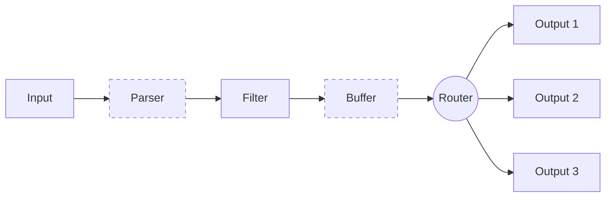

Levei mais tempo do que gostaria de admitir para entender a configuração do fluentbit e, assim como com o EKS, eu senti a necessidade de uma forma simples para testá-lo e quebrá-lo. Um bônus se também fosse reproduzível.

Geralmente uso o fluentbit para coletar logs do kubernetes e, assim, meu lab local é um lab kubernetes. Além disso, mexo bastante com o Terraform, de modo que usá-lo no lab foi uma escolha natural. O que nos leva aos [Pré-requisitos](#pré-requisitos).

## Pré-requisitos

1. Um cluster kubernetes local
2. Terraform
3. kubectl

O Item 1 possui muitas opções, no meu caso estou usando o cluster local fornecido pelo [Docker Desktop](https://docs.docker.com/desktop). Outras opções incluem o [minikube](https://minikube.sigs.k8s.io/docs/), o [kind](https://kind.sigs.k8s.io/), o [k3s](https://k3s-io.github.io/), etc.

Você pode instalar o Item 2 a partir do [site oficial](https://www.terraform.io/downloads.html). O mesmo vale para o [Item 3](https://kubernetes.io/docs/tasks/tools/).

Ferramentas instaladas, podemos prosseguir para a próxima seção.

## Executando o lab

Antes de partirmos para o código, vejamos como ele se parece quando funcionando. Para isso, clone o repositório [https://github.com/o-leolleo/a-kubernetes-local-lab](https://github.com/o-leolleo/a-kubernetes-local-lab) e navegue até o diretório `fluentbit`.

Depois, execute os seguintes comandos (certifique-se de que o cluster está em execução):

```bash
# Certifique-se de que o kubectl está configurado para o cluster correto
# (docker-desktop no meu caso)
kubectl config current-context

# Inicialize o workspace do terraform
terraform init

# Plan e apply do terraform, uma vez confirmado que as mudanças são as esperadas
terraform apply
```

O _apply_ deve mostrar um output similar ao seguinte:

[](terraform-plan.png)

e ao seguinte, após a confirmação:

[](terraform-apply.png)

Depois disso, você deve conseguir acessar o Kibana em [http://localhost:5601](http://localhost:5601). Vá em frente e clique no menu sanduíche, no canto superior esquerdo, e navegue até **Discover**. Clique em **Create data view** e informe o **Name** e o **index-pattern** como `kube-*`[^1]. Clique em **Save data view to Kibana** e você deverá ver algo similar ao abaixo [^2]:

[^1]: Os _index patterns_ `k*`, `ku*`, `kub*` também funcionariam, já que estamos enviando apenas _logs_ do kubernetes para o Elasticsearch.
[^2]: Realisticamente, poderíamos usar Terraform para criar o _index pattern_, trata-se de um bom exercício caso você esteja curioso. Talvez eu inclua isso aqui no futuro.

[](kibana-logs.png)

Esses são todos os _logs_ coletados pelo fluentbit do _cluster_ kubernetes, sinta-se à vontade para explorá-los!

Por fim, além do Kibana, também é possível debugar o fluentbit seguindo os seus logs via:

```bash
kubectl logs -n logging -l app=fluent-bit -f
```

## O código

Iniciamos a partir do arquivo `main.tf`, procedendo então para os outros, um por um. O código está inteiramente disponível no repositório [o-leolleo/a-kubernetes-local-lab](https://github.com/o-leolleo/a-kubernetes-local-lab).


### main.tf

Primeiro, definimos os nossos _providers_ necessários e os instanciamos.

```terraform
terraform {
  required_providers {
    kubernetes = {
      source  = "hashicorp/kubernetes"
      version = "~> 2.30" #1
    }
  }
}

provider "helm" {
  kubernetes {
    config_path    = "~/.kube/config" #2
    config_context = "docker-desktop" #3
  }
}

provider "kubernetes" {
  config_path    = "~/.kube/config"
  config_context = "docker-desktop"
}
```

1. Versão necessária para o _provider_ do kubernetes (`version >= 2.30 e version < 3`), veja mais em [Version Constraints](https://developer.hashicorp.com/terraform/language/expressions/version-constraints).
2. Caminho para o nosso arquivo de configuração `kubeconfig`.
3. _Context_ a ser utilizado (preferencialmente um local).

Aqui, realizar as mudanças em um _cluster_ remoto seria apenas uma questão de mudarmos o `config_context`, assumindo que o _cluster_ remoto já está configurado no seu arquivo [kubeconfig](https://kubernetes.io/docs/concepts/configuration/organize-cluster-access-kubeconfig/) e é acessível.

Seguimos então para a declaração da instalação do fluentbit via _resource_ [`helm_release`](https://registry.terraform.io/providers/hashicorp/helm/latest/docs/resources/release).

```terraform
resource "helm_release" "fluent_bit" {
  name             = "fluent-bit" #1
  repository       = "https://fluent.github.io/helm-charts"
  chart            = "fluent-bit"
  namespace        = "logging"
  create_namespace = true

  values = [
    file("./values-files/fluent-bit.values.yaml") #2
  ]
}
```

1. Nome da release do helm como exibido no cluster
2. Arquivo de valores a ser utilizado para a release do helm - discutiremos isso em breve

Esse é equivalente a executar os seguintes comandos.

```bash
# Adiciona o repositório do helm, com o nome fluent localmente
# não precisamos desse passo no terraform
helm repo add fluent https://fluent.github.io/helm-charts

helm install \
  fluent-bit \
  fluent/fluent-bit \
  --namespace logging \
  --values ./values-files/fluent-bit.values.yaml
  --create-namespace
```

No exemplo, `fluent-bit` é o nome da release do helm e `fluent/fluent-bit` é o chart a ser instalado (no formato `<repositório>/<chart>`), o restante é o mesmo que o descrito na documentação do [resource do Terraform](https://registry.terraform.io/providers/hashicorp/helm/latest/docs/resources/release).

O que resta do arquivo `main.tf` é dedicado à criação de instalações minimalistas do Elasticsearch e do Kibana.

```terraform
resource "kubernetes_manifest" "all" {
  for_each = local.manifests #1

  manifest = each.value #2

  depends_on = [
    helm_release.fluent_bit #3
  ]
}

locals {
  manifests = {
    for m in local._manifests :
    "${m.apiVersion}/${m.kind}/${m.metadata.name}" => m #4
  }

  _manifests = flatten([
    for file in fileset("./manifests", "**.yaml") : #5
    provider::kubernetes::manifest_decode_multi( #7
      file("./manifests/${file}")
    )
  ])
}
```

Apesar de pequeno, há muita coisa acontecendo aqui:

1. Iteramos sobre a variável local `manifests` que contém cada manifesto kubernetes como um [objeto do Terraform](https://developer.hashicorp.com/terraform/language/expressions/types#map), declarado em arquivos `.yaml` dentro do diretório `manifests`.
2. Atribuímos o objeto ao atributo `manifest`.
3. Garantimos que esses manifestos são criados somente após a release do helm `fluent-bit` ser criada, ou seja, após nosso coletor de logs estar em execução.
4. A variável local `manifests` é um mapa de objetos (manifestos kubernetes), indexados pela combinação de `apiVersion`, `kind` e `metadata.name`. `_manifests` é uma lista de todos os objetos.
5. Para cada arquivo no diretório `manifests` (e seus subdiretórios).
6. Decodificamos o arquivo manifesto em um [objeto do Terraform](https://developer.hashicorp.com/terraform/language/expressions/types#map).

Eu quebrei a variável local `manifests` em duas (sendo uma uma intermediária) para tornar a expressão mais legível [^3].

[^3]: Se você estiver curioso, isso seria o código resultante da utilização de uma única variável local
    ```terraform
      manifests = {
        for m in flatten([
          for file in fileset("./manifests", "**.yaml") :
          provider::kubernetes::manifest_decode_multi(
            file("./manifests/${file}")
          )
        ]):
        "${m.apiVersion}/${m.kind}/${m.metadata.name}" => m
      }
    ```

Não vou entrar em detalhes sobre os manifestos dos _deployments_ do Elasticsearch e do Kibana, eles são bem padrão e podem ser encontrados na pasta [o-leolleo/a-kubernetes-local-lab//fluentbit/manifests](https://github.com/o-leolleo/a-kubernetes-local-lab/tree/main/fluentbit/manifests).

### O arquivo de configuração (_values_) do fluentbit

Na configuração, especificamos, além de outras coisas, o fluxo de uma determinada mensagem de log através do _pipeline_ do fluentbit. Isso é detalhado no diagrama abaixo. O arquivo é composto por seções correspondentes a cada um dos estágios do _pipeline_, ilustrados como caixas na imagem. _Vamos deixar de fora da nossa discussão os estágios representados por caixas tracejadas_.



No diagrama acima, temos:
- **Input** corresponde às nossas fontes de log: arquivos de log, systemd, etc.
- **Filter** é onde manipulamos as mensagens de log, removendo ou adicionando campos, omitindo entradas de log, etc.
- **Output** especifica os destinos dos logs processados, por exemplo Elasticsearch, Kafka, etc.

Como estamos utilizando o helm para instalar o fluentbit, usamos um arquivo de valores para passar nossa configuração. Você pode conferir a lista completa de valores disponíveis [aqui](https://github.com/fluent/helm-charts/blob/main/charts/fluent-bit/values.yaml). Nos bastidores, cada propriedade de `config` é transformada em uma seção do arquivo de configuração do fluentbit.

O arquivo de valores é detalhado abaixo.

```yaml
config:
  # 1
  service: |
    [SERVICE]
        Daemon Off
        Flush {{ .Values.flush }}
        Log_Level {{ .Values.logLevel }}
        Parsers_File /fluent-bit/etc/parsers.conf
        Parsers_File /fluent-bit/etc/conf/custom_parsers.conf
        HTTP_Server On
        HTTP_Listen 0.0.0.0
        HTTP_Port {{ .Values.metricsPort }}
        Health_Check On

  #2
  inputs: |
    [INPUT]
        Name tail
        Path /var/log/containers/*.log
        multiline.parser docker, cri
        Tag kube.*
        Mem_Buf_Limit 5MB
        Skip_Long_Lines On

    [INPUT]
        Name systemd
        Tag host.*
        Systemd_Filter _SYSTEMD_UNIT=kubelet.service
        Read_From_Tail On

  #3
  filters: |
    [FILTER]
        Name kubernetes
        Match kube.*
        Merge_Log On
        Keep_Log Off
        K8S-Logging.Parser On
        K8S-Logging.Exclude On

  #4
  outputs: |
    [OUTPUT]
        Name es
        Match kube.*
        Host elasticsearch
        Suppress_Type_Name On
        Logstash_Prefix kube
        Logstash_Format On
        Trace_Error On
        Retry_Limit False
        Replace_Dots On

    [OUTPUT]
        Name es
        Match host.*
        Host elasticsearch
        Suppress_Type_Name On
        Logstash_Format On
        Logstash_Prefix node
        Trace_Error On
        Retry_Limit False
        Replace_Dots On
```

Vamos analisá-lo:
1. A seção `service` é onde definimos a configuração global do fluentbit, como o nível de log, intervalo de _flush_, etc. Esta seção não faz parte do diagrama de fluxo de dados acima. O `{{ .Values.flush }}` e semelhantes são tratados pelo mecanismo de template do helm, e são substituídos pelos valores informados no arquivo `values.yaml`, que têm padrões definidos pelo  _helm chart_. Observe que o fluentbit também escuta em uma porta para métricas, usadas pelo prometheus para coletar dados de monitoramento.
2. Como `inputs`, especificamos tanto os logs do containerd dos containers kubernetes quanto os logs do systemd do host.
3. Aqui, usamos apenas o filtro embutido do fluentbit para kubernetes para realizar o "_parse_" dos logs sendo processados.
4. Ambos os `outputs` enviam os logs para a mesma instância do elasticsearch, porém para diferentes índices do Elasticsearch, informados pela propriedade `Logstash_Prefix`. Observe como roteamos os logs com base na propriedade `Match`, esta é efetivamente a etapa de roteamento mostrada no diagrama acima, e roteamos os logs com base nas tags que informamos em nossos `inputs`.

A relação do filtro de log tail e os logs do kubernetes é muito bem discutida na [documentação do fluentbit](https://docs.fluentbit.io/manual/pipeline/filters/kubernetes). Não entrarei em muitos detalhes sobre, mas vale a pena dar uma lida se você estiver interessado. Para os propósitos deste post, é suficiente saber que o `.*` na `Tag kube.*` é substituído pelo caminho absoluto do arquivo monitorado, com as barras substituídas por pontos. Além disso, citando a própria documentação (em tradução livre):

<!-- Conferir como melhorar essa tradução aqui :) -->
> Quando o Filter Kubernetes é executado, ele tentará fazer a seleção de todos os registros que começam com `kube.` (note o ponto final), de modo que os registros do arquivo mencionado acima serão selecionados e enriquecidos

Os logs na seção de outputs são tratados de modo semelhante, bem como os logs com a tag `hosts.*`. Por algum motivo, não obtive nenhum log `host.*` no meu lab local.

## Um caso de uso: separando os logs por tipo

Agora, vamos supor que, por algum motivo, você quisesse salvar logs diferentes em índices diferentes com base em uma categoria ou tipo de log arbitrário. Por exemplo, você pode querer registrar os logs dos _namespaces_ `kube-system` e `logging` em índices `system-*`, logs do istio em índices `istio-*` e todos os outros em índices `workloads-*`. Ou, talvez, você busca um conjunto diferente de categorias. Isso pode ser resolvido modificando-se ligeiramente nossa configuração do fluentbit (configuração  completa neste [link](https://github.com/o-leolleo/a-kubernetes-local-lab/blob/main/fluentbit/values-files/fluent-bit-split-by-type.values.yaml)).

Podemos adicionar mais dois filtros além do `kubernetes`:

```yaml
filters:
  # ...
  [FILTER]
      Name modify #1
      Match kube.* #2

      Condition Key_value_matches $kubernetes['namespace_name'] ^(kube-system|logging)$ #3

      Add log_type system #4


  [FILTER]
      Name modify
      Match kube.*

      Condition Key_value_matches $kubernetes['namespace_name'] ^istio-.*$ #5

      Add log_type ingress #6
```

Aqui, fazemos o seguinte:

1. instanciamos o filtro [`modify`](https://docs.fluentbit.io/manual/pipeline/filters/modify).
2. para cada registro de log que corresponde à tag `kube.*` (ou todos os logs do kubernetes).
3. se o campo `namespace_name` corresponder a `kube-system` ou `logging`.
4. adicionamos um novo campo `log_type` com o valor `system`.
5. se o campo `namespace_name` corresponder a `istio-*`.
6. adicionamos um novo campo `log_type` com o valor `ingress`.

Com isso, podemos modificar ligeiramente nossa saída do elasticsearch, para a tag `kube.*`, para:

```yaml
outputs:
  # ...
  [OUTPUT]
      Name es
      Match kube.*
      Host elasticsearch
      Suppress_Type_Name On
      Logstash_Prefix_Key $log_type #1
      Logstash_Prefix workloads #2
      Logstash_Format On
      Trace_Error On
      Retry_Limit False
      Replace_Dots On
```

Aqui, apenas adicionamos a propriedade `Logstash_Prefix_Key` [^4] (1) e mudamos o `Logstash_Prefix` para `workloads` (2). Nossos logs serão indexados como `$log_type-YYYY.MM.DD` se `$log_type` não for nulo, e `workloads-YYYY.MM.DD` caso contrário.

[^4]: O fato de `Logstash_Prefix_Key` aceitar um [acessador de registro](https://docs.fluentbit.io/manual/administration/configuring-fluent-bit/classic-mode/record-accessor) o torna muito flexível e evita a necessidade de criar várias saídas para cada tipo de log. Caso você queira dividir logs por namespace, poderia usar `Logstash_Prefix_Key $kubernetes['namespace_name']`, por exemplo.

Com isso, após aplicar as alterações através de um `terraform apply`, obtemos o resultado mostrado na imagem abaixo, onde podemos ver cada índice específico do tipo de log.

[](logs-split-by-type.png)

Nossos índices estão em estado `yellow` porque temos apenas um nó Elasticsearch (você pode ler mais [aqui](https://stackoverflow.com/questions/60819814/what-does-it-mean-when-an-elasticsearch-index-has-yellow-health#:~:text=1%20common%20reason%20is%20if,indices%20would%20always%20be%20yellow.)).

## Conclusão

Aqui, discutimos como criar um laboratório local de kubernetes com fluentbit usando Terraform, onde pudemos explorar e experimentar sua configuração. Usamos implantações mínimas do Elasticsearch e Kibana para visualizar os logs coletados e também discutimos como dividir os logs por tipo usando filtros do fluentbit. O código também foi discutido e está disponível no repositório [o-leolleo/a-kubernetes-local-lab](https://github.com/o-leolleo/a-kubernetes-local-lab/tree/main/fluentbit).

A chave aqui é que agora temos uma configuração que podemos ajustar e quebrar com segurança, a fim de testar suposições e obter feedback rápido.
Sinta-se à vontade para experimentar!
