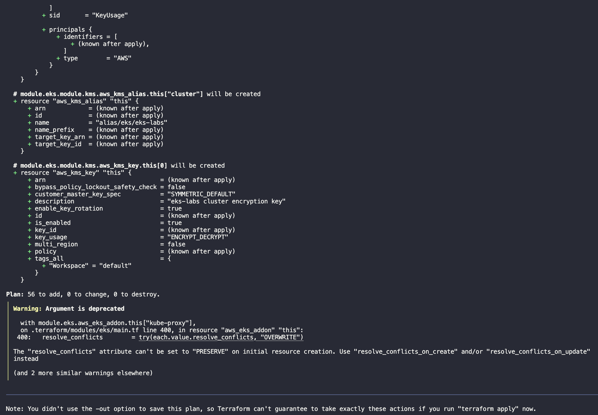
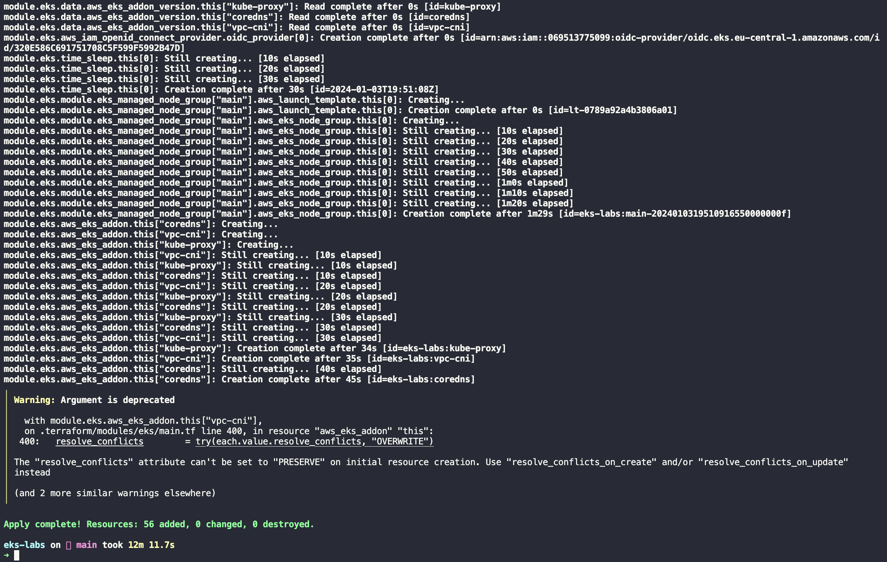
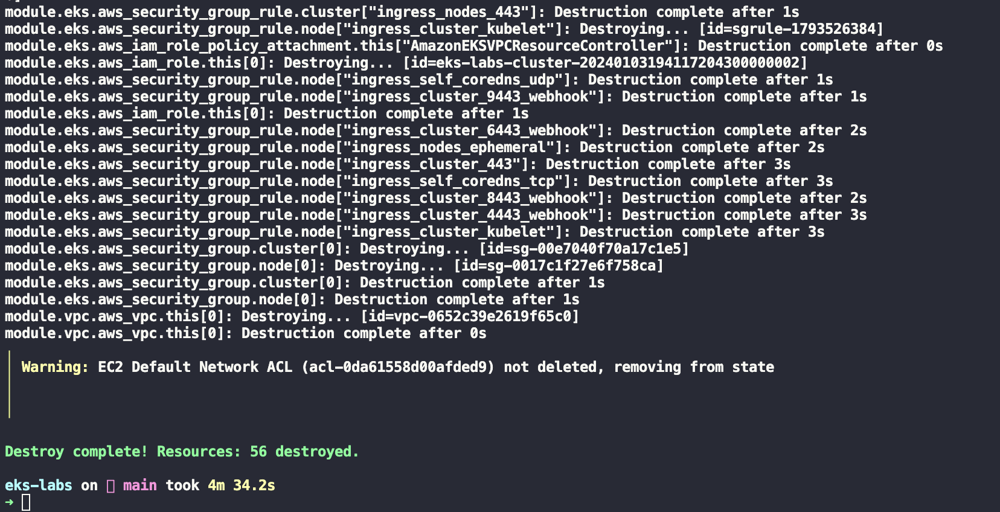

I’ve decided to experiment with different EKS scenarios and configurations. But also thought that giving an introductory blog post on how to bootrstrap your own EKS cluster might help someone out there trying to do the same thing.

For that I'm using [Terraform](https://www.terraform.io/) and the [AWS EKS Terraform module](https://registry.terraform.io/modules/terraform-aws-modules/eks/aws/latest). The first is a very well known solution for maintaining infrastructure as code (IaC). The later is the best community maintained module - that I know of - for it and which covers most (if not all) the different EKS use cases.

The resources created here costs money, so if you're following it up, **I highly recommend that you destroy your terraform resources once finished, so you're not caught out of surprise with a considerable AWS bill**. I've even gone as far as [detroying my personal AWS account resources on a schedule](/blog/wiping-your-aws-account-with-aws-nuke-and-gitlab-ci/) - be careful if doing something similar.


## The variables

The setup relies on a YAML file for configuring what would be otherwise done via variables and/or a tfvars file. I've been convinced of the benefits of this approach by the post [Terraform with YAML: Part 1](https://xebia.com/blog/terraform-with-yaml-part-1/) from Chris ter Beke. It's simple, effective, and uses terraform built-in constructs. It allows greater flexibility on managing the inputs of your terraform workspace.

In our case, these inputs are shown on the snippet below, where we define the AWS region where we want to create our cluster and its reosurces, the cluster name, version, availability zones and VPC related parameters.

```yaml
# config.yaml
region: eu-central-1 # Frankfurt
cluster_name: eks-labs
cluster_version: '1.29'
vpc:
  # Private IP range (see https://en.wikipedia.org/wiki/Private_network)
  cidr: 10.0.0.0/16
```

We can later read those config values through the code below, and access them like `local.config.region` or `local.config.vpc.cidr` on our terraform code.

```terraform
# variables.tf
locals {
  config = yamldecode(file("config.yaml"))
}
```

## The code

With our configs in place we can start the code to create the cluster itself.

First, we declare our required providers and the `provider` block, shown on the snippet below. We're using the official AWS provider with a version between `>=5.29` and `<6` (See [Version Constraint Syntax](https://developer.hashicorp.com/terraform/language/expressions/version-constraints#version-constraint-syntax)). The resources are created on the `local.config.region` region as discussed on the [previous section](#the-variables). On top of that, all resources we create are tagged accordingly to the workspace we use on our runs, for easier identification and cross reference.

```terraform
terraform {
  required_providers {
    aws = {
      source  = "hashicorp/aws"
      version = "~> 5.29"
    }
  }
}

provider "aws" {
  region = local.config.region

  default_tags {
    tags = {
      Workspace = terraform.workspace
    }
  }
}
```

We then define the [VPC (Virtual Private Network)](https://docs.aws.amazon.com/vpc/latest/userguide/what-is-amazon-vpc.html) onto which our resources will be created. Here we use the well known [terraform-aws-vpc](https://registry.terraform.io/modules/terraform-aws-modules/vpc/aws/latest) community module.

```terraform
module "vpc" {
  source = "terraform-aws-modules/vpc/aws"

  name = local.config.cluster_name
  cidr = local.config.vpc.cidr

  azs = data.aws_availability_zones.this.names

  private_subnets = [for k, v in data.aws_availability_zones.this.names : cidrsubnet(local.config.vpc.cidr, 4, k)]
  public_subnets  = [for k, v in data.aws_availability_zones.this.names : cidrsubnet(local.config.vpc.cidr, 8, k + 48)]

  enable_nat_gateway = true

  single_nat_gateway   = true
  enable_dns_hostnames = true

  public_subnet_tags = {
    "kubernetes.io/role/elb" = 1
  }

  private_subnet_tags = {
    "kubernetes.io/role/internal-elb" = 1
  }
}
```

The network is named after our cluster, its CIDR and most of its settings are passed from the `config.yaml` file, [discussed earlier](#the-variables). I won't dig into how to calculate the subnets CIDRs and its details, but I found this clever trick on one of the [terraform-aws-eks module examples](https://github.com/terraform-aws-modules/terraform-aws-eks/blob/v20.8.3/examples/karpenter/main.tf#L289).

We also allow [DNS hostnames and support](https://docs.aws.amazon.com/vpc/latest/userguide/vpc-dns.html#vpc-dns-support) on the VPC and [reuse the same NAT gateway on all its subnets](https://registry.terraform.io/modules/terraform-aws-modules/vpc/aws/latest#single-nat-gateway). The first has little impact to what we discuss on this post, the later helps us reduce the cost of the overall setup.

The `kubernetes.io/role/elb` and `kubernetes.io/role/internal-elb` tags allows these subnets to be auto discovered by the [AWS Load Balancer Controller](https://kubernetes-sigs.github.io/aws-load-balancer-controller/v2.1/deploy/subnet_discovery/), which we'll discuss in a later post.

With the VPC in place we proceed to declare the cluster and its supporting resources, snippet below.

```terraform
module "eks" {
  source  = "terraform-aws-modules/eks/aws"
  version = "~> 19.20"

  cluster_name    = local.config.cluster_name
  cluster_version = local.config.cluster_version

  cluster_addons = {
    coredns = {
      most_recent = true
    }
    kube-proxy = {
      most_recent = true
    }
    vpc-cni = {
      most_recent = true
    }
  }

  vpc_id     = module.vpc.vpc_id
  subnet_ids = module.vpc.private_subnets

  cluster_endpoint_public_access = true

  cluster_endpoint_public_access_cidrs = [
    "${data.external.current_ip.result.ip}/32",
  ]

  eks_managed_node_group_defaults = {
    ami_type = "AL2_x86_64"
  }

  eks_managed_node_groups = {
    main = {
      min_size     = 1
      max_size     = 3
      desired_size = 1

      instance_types = ["t3.small"]

      capacity_type = "SPOT"
    }
  }
}

# See https://tom-henderson.github.io/2021/04/20/terraform-current-ip.html
data "external" "current_ip" {
  program = ["bash", "-c", "curl -s 'https://api.ipify.org?format=json'"]
}

data "aws_availability_zones" "this" {
  state = "available"
}
```

Most of the main parameters we need are defined as specifyed on the `config.yaml` file. We also install some EKS available addons. Explaining each of them is out of the scope of this post, it's enough to say for our purposes that we need them for our cluster to correctly function - you can read more about them on [Amazon EKS add-ons](https://docs.aws.amazon.com/eks/latest/userguide/eks-add-ons.html).

We then pass the VPC ID of the VPC we created earlier, and its private subnets IDs. This can't be changed after cluster creation. Also, since I want to access the cluster API from the internet, I set `cluster_endpoint_public_access` to `true`. I restrict this public access to the IP address of my home network.

For the nodes we use EKS managed node groups for simplicity, each of them being an AWS Linux `t3.small` SPOT instance. We allow the associated autoscaling group to grow from one up to three nodes. This will give us room to test things out without spending too much money.

_Having a node group, won't automatically scale up the node count based on load, for that we'd need to use the [cluster autoscaler](https://github.com/kubernetes/autoscaler) or [karpenter](https://karpenter.sh/)_.

With all the definitions in place, time to create the cluster.

## Terraform plan and apply

My terraform plan output is (partially) shown below. The warning is a [known issue within the module](https://github.com/terraform-aws-modules/terraform-aws-eks/issues/2635), due to some updates introduced by the AWS provider in its version v5.0.1

[](terraform-plan.png)

After reviewing it and making sure everything looks as expected, we can apply it (partial output below). Creating all the resources takes around 15min.

[](terraform-apply.png)

Running `terraform output list | wc -l` will show us that we have 70 resources in our state, this differs from the above outputs because it includes the data sources internally used by the modules we're using. Filtering those out by running `terraform output list | grep -v '\.data\.' | wc -l` will show us the 56 resources we were expecting. We can now test our access to the cluster and experiment with it.

## Accessing the cluster

We can use the same credentials we used to authenticate terraform for creating the cluster to authenticate ourselves to the cluster. We do this by running the command below.
you might need to specify the region either via `--region` or the `AWS_DEFAULT_REGION` environment variable (See [Configure the AWS CLI](https://docs.aws.amazon.com/cli/latest/userguide/cli-chap-configure.html)).

```shell-session
$ aws eks update-kubeconfig --name eks-labs --alias eks-labs
```

This command will update our [`~/.kube/config`](https://kubernetes.io/docs/concepts/configuration/organize-cluster-access-kubeconfig/) file with the cluster information, and create a new [context](https://kubernetes.io/docs/tasks/access-application-cluster/configure-access-multiple-clusters/) named `eks-labs` (the alias we gave to our cluster). The above command also sets the created context as the current one, so we can start using it right away.

We can test our access to the cluster by running the `kubectl version` command. Its output should look something like the output below. Client version is the version of the `kubectl` binary we're using, and the server version is the version of the k8s API server we're connecting to. The later means kubectl can connect to the cluster and authenticate itself. We can also notice I'm running a version of the kubectl binary out of the supported minor version skew. I've been successfully using this version for a while now, but if you run into any issues, you might need to update it to one version above or below, or the same as the server version.

```shell-session
Client Version: v1.29.0
Kustomize Version: v5.0.4-0.20230601165947-6ce0bf390ce3
Server Version: v1.27.8-eks-8cb36c9
WARNING: version difference between client (1.29) and server (1.27) exceeds the supported minor version skew of +/-1
```

We can now also run a couple more commands just in case, like `kubectl get nodes` and `kubectl get pods --all-namespaces` which will list, respectively, the nodes and pods of our cluster. My output is shown below.

```shell-session
$ kubectl get nodes
NAME                                           STATUS   ROLES    AGE   VERSION
ip-10-0-35-110.eu-central-1.compute.internal   Ready    <none>   107s   v1.29.0-eks-5e0fdde

$ kubectl get pods --all-namespaces # or kubectl get pods -A
NAMESPACE     NAME                       READY   STATUS    RESTARTS   AGE
kube-system   aws-node-xrnfv            2/2     Running   0          75s
kube-system   coredns-6566b9c9f-2bnbr   1/1     Running   0          75s
kube-system   coredns-6566b9c9f-kwp6r   1/1     Running   0          75s
kube-system   kube-proxy-9gcmv          1/1     Running   0          75s
```

## Cleaning up

Once finished with our experiments, and to avoid a surprise billing from AWS, we can destroy our cluster and the associated resources by running `terraform destroy`.

[](terraform-destroy.png)

## Conclusion

We've successfully created a functional EKS cluster, connected to it and ran some simple commands. The whole setup is managed as code, making it reproducible and easy to maintain. It still lacks a few things, like common addons like ingress controllers, monitoring and logging solutions, as well as a proper IAM setup. The idea is to cover those on future posts. So stay tuned!
