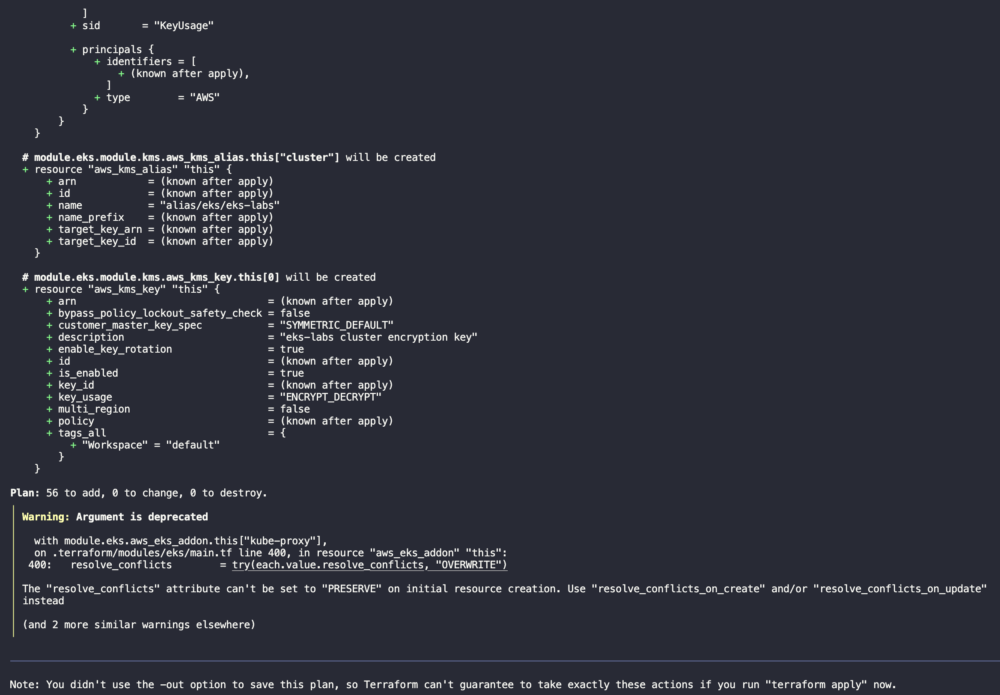
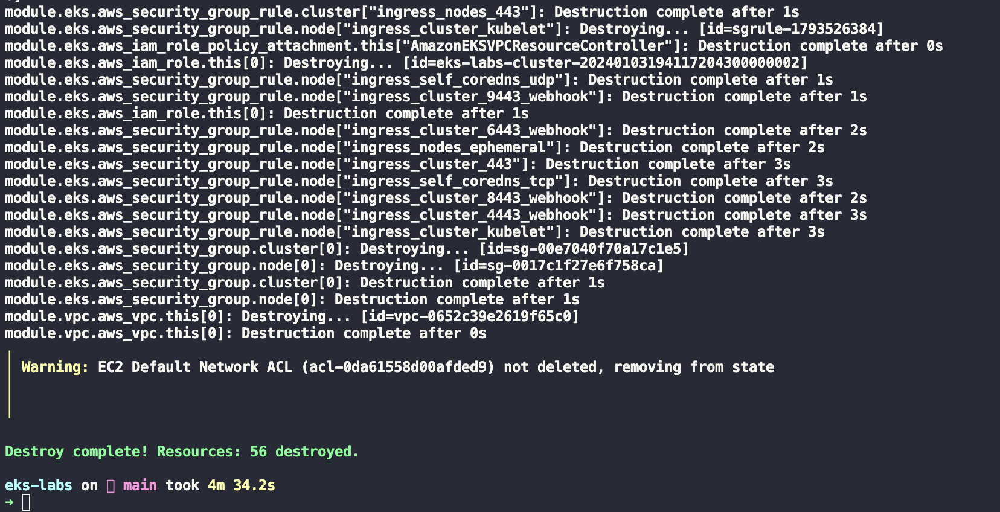

Eu decidi experimentar com diferentes cenários e configurações do EKS, mas também pensei que fornecer um _post_ introdutório sobre como inicializar seu próprio cluster EKS poderia ajudar alguém por aí tentando fazer a mesma coisa.

Para isso, estou usando o [Terraform](https://www.terraform.io/) e o [módulo Terraform para AWS EKS](https://registry.terraform.io/modules/terraform-aws-modules/eks/aws/latest). O primeiro é uma solução muito conhecida para manter infraestrutura como código (IaC). O último é o melhor módulo mantido pela comunidade - que eu conheço - para isso e que cobre a maioria (se não todos) os diferentes casos de uso do EKS.

Os recursos criados neste _post_ custam dinheiro, então, se você o estiver seguindo, **recomendo fortemente que destrua seus recursos do Terraform assim que terminar, para não ser pego de surpresa por uma conta considerável da AWS**. Eu até fui tão longe a ponto de [destruir os recursos da minha conta pessoal da AWS em um cronograma](/blog/wiping-your-aws-account-with-aws-nuke-and-gitlab-ci/) - tenha cuidado se estiver fazendo algo semelhante.

## As variáveis

O _setup_ depende de um arquivo YAML para configurar o que, de outra forma, seria feito por meio de variáveis e/ou um arquivo tfvars. Fui convencido dos benefícios dessa abordagem pelo _post_ [Terraform with YAML: Part 1](https://xebia.com/blog/terraform-with-yaml-part-1/) de Chris ter Beke. É simples, eficaz e usa construções internas do Terraform. Ele permite uma maior flexibilidade na gestão das entradas do seu [_workspace_](https://developer.hashicorp.com/terraform/language/state/workspaces) Terraform.

No nosso caso, essas entradas são mostradas no _snippet_ abaixo, onde definimos a região da AWS onde queremos criar nosso cluster e seus recursos, o nome do cluster, a versão, as zonas de disponibilidade e os parâmetros relacionados ao VPC.

```yaml
# config.yaml
region: eu-central-1 # Frankfurt
cluster_name: eks-labs
cluster_version: '1.29'
vpc:
  # Intervalo de IPs privados (see https://en.wikipedia.org/wiki/Private_network)
  cidr: 10.0.0.0/16
```

Nós podemos posteriormente ler esses valores através do código abaixo e acessá-los como `local.config.region` ou `local.config.vpc.cidr` no nosso código Terraform.

```terraform
# variables.tf
locals {
  config = yamldecode(file("config.yaml"))
}
```

## O código

Com nossas configurações prontas, podemos começar o código para criar o cluster propriamente dito.

Primeiro, declaramos os nossos _required providers_ e o bloco `provider`, mostrado no _snippet_ abaixo. Estamos usando o _provider_ oficial da AWS com uma versão entre `>=5.29` e `<6` (Veja [Version Constraint Syntax](https://developer.hashicorp.com/terraform/language/expressions/version-constraints#version-constraint-syntax)). Os recursos são criados na região `local.config.region` conforme discutido na [seção anterior](#as-variáveis). Além disso, todos os recursos que criamos são marcados de acordo com o _workspace_ que usamos em nossas execuções, para facilitar a identificação e a referência cruzada.

```terraform
terraform {
  required_providers {
    aws = {
      source  = "hashicorp/aws"
      version = "~> 5.29"
    }
  }
}

provider "aws" {
  region = local.config.region

  default_tags {
    tags = {
      Workspace = terraform.workspace
    }
  }
}
```

Nós então definimos a [VPC (Virtual Private Network)](https://docs.aws.amazon.com/pt_br/vpc/latest/userguide/what-is-amazon-vpc.html) na qual nossos recursos serão criados. Aqui usamos o módulo [terraform-aws-vpc](https://registry.terraform.io/modules/terraform-aws-modules/vpc/aws/latest).

```terraform
module "vpc" {
  source = "terraform-aws-modules/vpc/aws"

  name = local.config.cluster_name
  cidr = local.config.vpc.cidr

  azs = data.aws_availability_zones.this.names

  private_subnets = [for k, v in data.aws_availability_zones.this.names : cidrsubnet(local.config.vpc.cidr, 4, k)]
  public_subnets  = [for k, v in data.aws_availability_zones.this.names : cidrsubnet(local.config.vpc.cidr, 8, k + 48)]

  enable_nat_gateway = true

  single_nat_gateway   = true
  enable_dns_hostnames = true

  public_subnet_tags = {
    "kubernetes.io/role/elb" = 1
  }

  private_subnet_tags = {
    "kubernetes.io/role/internal-elb" = 1
  }
}
```

A rede é nomeada de acordo com o nosso _cluster_, seu CIDR e a maioria de suas configurações vêm do arquivo `config.yaml`, [discutido anteriormente](#as-variáveis). Não vou entrar em detalhes sobre como calcular os CIDRs das sub-redes e seus detalhes, mas encontrei um truque inteligente em um dos [exemplos do módulo terraform-aws-eks](https://github.com/terraform-aws-modules/terraform-aws-eks/blob/v20.8.3/examples/karpenter/main.tf#L289).

Também permitimos o [suporte e hostnames DNS](https://docs.aws.amazon.com/pt_br/vpc/latest/userguide/vpc-dns.html#vpc-dns-support) no VPC e [reutilizamos o mesmo gateway NAT em todas as suas sub-redes](https://registry.terraform.io/modules/terraform-aws-modules/vpc/aws/latest#single-nat-gateway). O primeiro tem pouco impacto no que discutimos neste _post_, o último nos ajuda a reduzir o custo geral do nosso _setup_.

As _tags_ `kubernetes.io/role/elb` e `kubernetes.io/role/internal-elb` permitem que essas sub-redes sejam descobertas automaticamente pelo [AWS Load Balancer Controller](https://kubernetes-sigs.github.io/aws-load-balancer-controller/v2.1/deploy/subnet_discovery/), o que discutiremos em um _post_ futuro.

Com a VPC codificada, declararamos então o cluster e seus recursos auxiliriares, _snippet_ abaixo.

```terraform
module "eks" {
  source  = "terraform-aws-modules/eks/aws"
  version = "~> 19.20"

  cluster_name    = local.config.cluster_name
  cluster_version = local.config.cluster_version

  cluster_addons = {
    coredns = {
      most_recent = true
    }
    kube-proxy = {
      most_recent = true
    }
    vpc-cni = {
      most_recent = true
    }
  }

  vpc_id     = module.vpc.vpc_id
  subnet_ids = module.vpc.private_subnets

  cluster_endpoint_public_access = true

  cluster_endpoint_public_access_cidrs = [
    "${data.external.current_ip.result.ip}/32",
  ]

  eks_managed_node_group_defaults = {
    ami_type = "AL2_x86_64"
  }

  eks_managed_node_groups = {
    main = {
      min_size     = 1
      max_size     = 3
      desired_size = 1

      instance_types = ["t3.small"]

      capacity_type = "SPOT"
    }
  }
}

# Veja https://tom-henderson.github.io/2021/04/20/terraform-current-ip.html
data "external" "current_ip" {
  program = ["bash", "-c", "curl -s 'https://api.ipify.org?format=json'"]
}

data "aws_availability_zones" "this" {
  state = "available"
}
```

A maioria dos parâmetros principais que precisamos são definidos conforme especificado no arquivo `config.yaml`. Também instalamos alguns _add-ons_ (Complementos, na tradução da documentação oficial) disponíveis no EKS. Explicar cada um deles está fora do escopo deste _post_, é suficiente para os nossos propósitos dizer que precisamos deles para que nosso cluster funcione corretamente - você pode ler mais sobre eles em [Complementos do Amazon EKS](https://docs.aws.amazon.com/pt_br/eks/latest/userguide/eks-add-ons.html).

Nós então passamos o ID da VPC que criamos anteriormente, e os IDs de suas sub-redes privadas. Isso não pode ser alterado após a criação do cluster. Além disso, como quero acessar a API do cluster através internet, defino `cluster_endpoint_public_access` como `true`. Eu restringo esse acesso público ao endereço IP da minha rede doméstica.

Para os nós, usamos _node groups_ gerenciados pelo EKS por simplicidade, cada um deles sendo uma instância SPOT AWS Linux `t3.small`. Permitimos que o _autoscaling group_ associado cresça de um a três nós. Isso nos dará espaço para testar as coisas sem gastar muito dinheiro.

_Ter um **node group** não dimensionará automaticamente o número de nós do grupo com base na carga, precisaríamos usar o [cluster autoscaler](https://github.com/kubernetes/autoscaler) ou o [karpenter](https://karpenter.sh/)_.

Com todas as definições no lugar, é hora de criar o cluster.

## Terraform _plan_ e _apply_

A saída do meu `terraform plan` é mostrada abaixo. O aviso é um [problema conhecido do módulo utilizado](https://github.com/terraform-aws-modules/terraform-aws-eks/issues/2635), devido a atualizações introduzidas pela versão v5.0.1 do _provider_ AWS.

[](terraform-plan.png)

Após revisá-lo e garantir que tudo parece conforme o esperado, podemos aplicá-lo (saída parcial abaixo). A criação de todos os recursos leva cerca de 15 minutos.

[](terraform-apply.png)

Executar `terraform output list | wc -l` nos mostrará que temos 70 recursos em nosso estado, isso difere das saídas acima porque inclui os _data sources_ utilizados internamente pelos módulos que estamos usando. Filtrá-los executando `terraform output list | grep -v '\.data\.' | wc -l` nos mostrará os 56 recursos que esperávamos. Agora podemos testar nosso acesso ao cluster e experimentar com ele.

## Acessando o cluster

Podemos usar as mesmas credenciais que usamos para autenticar o Terraform para criar o cluster para nos autenticar no cluster. Fazemos isso executando o comando abaixo.
Pode ser que você precise especificar a região via `--region` ou via variável de ambiente `AWS_DEFAULT_REGION` (Veja [Configurar o AWS CLI](https://docs.aws.amazon.com/pt_br/cli/latest/userguide/cli-chap-configure.html)).

```shell-session
$ aws eks update-kubeconfig --name eks-labs --alias eks-labs
```

Esse comando irá atualizar o nosso arquivo [`~/.kube/config`](https://kubernetes.io/docs/concepts/configuration/organize-cluster-access-kubeconfig/) com as informações do cluster, e criar um novo [contexto](https://kubernetes.io/docs/tasks/access-application-cluster/configure-access-multiple-clusters/) chamado `eks-labs` (o _alias_ que demos ao nosso cluster). O comando acima também define o contexto criado como o atual, para que possamos começar a utilizá-lo imediatamente.

Podemos testar o nosso acesso ao cluster executando o comando `kubectl version`. Sua saída deve se parecer com a saída abaixo. A versão do cliente é a versão do binário `kubectl` que estamos usando, e a versão do servidor é a versão do servidor da API do k8s ao qual estamos nos conectando. O último significa que o kubectl pode se conectar ao cluster e se autenticar.

```shell-session
$ kubectl version
Client Version: v1.29.0
Kustomize Version: v5.0.4-0.20230601165947-6ce0bf390ce3
Server Version: v1.29.1-eks-b9c9ed7
```

Agora podemos executar alguns comandos extras, somente por precaução, como `kubectl get nodes` e `kubectl get pods --all-namespaces` que listarão, respectivamente, os nós e _pods_ do nosso cluster. Minha saída é mostrada abaixo.

```shell-session
$ kubectl get nodes
NAME                                           STATUS   ROLES    AGE   VERSION
ip-10-0-35-110.eu-central-1.compute.internal   Ready    <none>   107s   v1.29.0-eks-5e0fdde

$ kubectl get pods --all-namespaces # or kubectl get pods -A
NAMESPACE     NAME                       READY   STATUS    RESTARTS   AGE
kube-system   aws-node-xrnfv            2/2     Running   0          75s
kube-system   coredns-6566b9c9f-2bnbr   1/1     Running   0          75s
kube-system   coredns-6566b9c9f-kwp6r   1/1     Running   0          75s
kube-system   kube-proxy-9gcmv          1/1     Running   0          75s
```

## Limpando tudo

Uma vez finalizados nossos experimentos, e para evitar cobranças inesperadas da AWS, podemos destruir nosso cluster e os recursos associados executando `terraform destroy`.

[](terraform-destroy.png)

## Conclusão

Criamos com sucesso um cluster EKS funcional, conectamos a ele e executamos alguns comandos simples. Todo o _setup_ é gerenciado como código, tornando-o reproduzível e fácil de manter. Ainda faltam algumas coisas, por exemplo _add-ons_ comuns como controladores de ingress, soluções de monitoramento e _logging_, bem como um _setup_ IAM adequado. A ideia é cobrir esses tópicos em _posts_ futuros. Então fique ligado!
