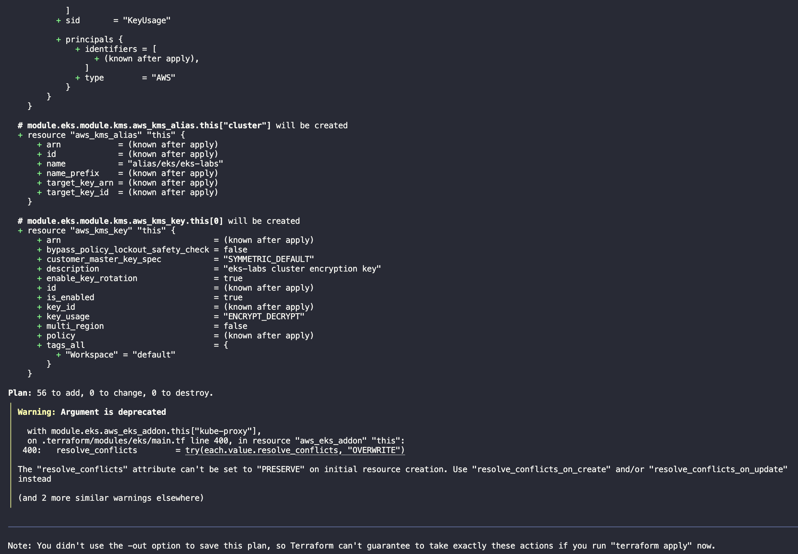
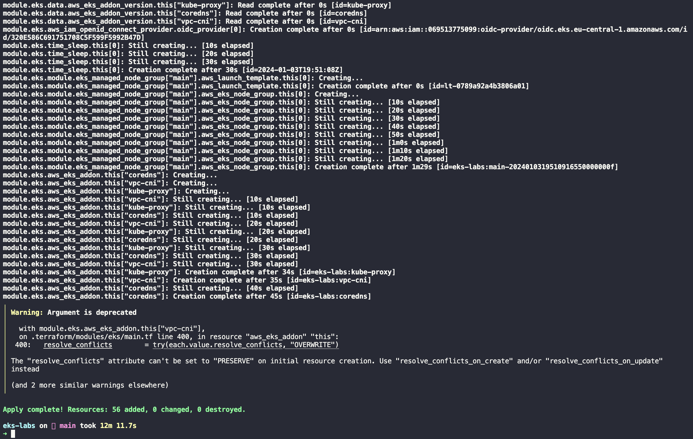

I’ve decided to experiment with different EKS scenarios and configurations. But also thought that giving an introductory blog post on how to bootrstrap your own EKS cluster might help someone out there trying to do the same thing.

For that I'm using [Terraform](https://www.terraform.io/) and the [AWS EKS Terraform module](https://registry.terraform.io/modules/terraform-aws-modules/eks/aws/latest). The first is a very well known solution for maintaining infrastructure as code (IaC). The later is the best community maintained module - that I know of - for it and which covers most (if not all) the different EKS use cases.

I have to mention that this setup costs money, so if you're following it up, **I highly recommend that you destroy your terraform resources once finished, so you're not caught out of surprise with a considerable AWS bill**. I've even gone as far as [detroying my personal AWS account resources on a schedule](/blog/wiping-your-aws-account-with-aws-nuke-and-gitlab-ci/) - be careful if doing something similar.


## The variables

The setup relies on a YAML file for configuring what would be otherwise done via variables and a tfvars file. I've been convinced of the benefits of this approach by a [very nice blog post](https://xebia.com/blog/terraform-with-yaml-part-1/). To summarize, it allows greater flexibility on managing the inputs of your terraform workspace.

Our inputs are shown on the snippet below.

```yaml
# config.yaml
region: eu-central-1 # Frankfurt
cluster_name: eks-labs
vpc:
  # Private IP range (see https://en.wikipedia.org/wiki/Private_network)
  cidr: 10.0.0.0/16
  # We'll create one private and public subnet per availability zone
  azs: 
    - eu-central-1a
    - eu-central-1b
    - eu-central-1c
  # Each private subnet's IP range
  private_subnets: 
    - 10.0.1.0/24
    - 10.0.2.0/24
    - 10.0.3.0/24
  # Each public subnet's IP range
  public_subnets: 
    - 10.0.101.0/24
    - 10.0.102.0/24
    - 10.0.103.0/24
```

And we later refer to the values on this file through

```terraform
# variables.tf
locals {
  config = yamldecode(file("config.yaml"))
}
```

## The code

With our configs in place we can start the code to create the cluster itself. 

First, we declare our required providers and the provider block, shown on the snippet below. We're using the official AWS provider with a version between  `>=5.29` and `<6`, and we inform to the provider that our resources will be created in whatever `region` is specified on our `config.yaml`. On top of that, all resources we create are tagged accordingly to the workspace we use on our runs.

```terraform
terraform {
  required_providers {
    aws = {
      source  = "hashicorp/aws"
      version = "~> 5.29"
    }
  }
}

provider "aws" {
  region = local.config.region

  default_tags {
    tags = {
      Workspace = terraform.workspace
    }
  }
}
```

Second, we define the VPC (Virtual Private Network) onto which our resources will be created. We use a well known community module for this, you can read more about it [here](https://registry.terraform.io/modules/terraform-aws-modules/vpc/aws/latest). 

```terraform
module "vpc" {
  source = "terraform-aws-modules/vpc/aws"

  name = local.config.cluster_name
  cidr = local.config.vpc.cidr

  azs             = local.config.vpc.azs
  private_subnets = local.config.vpc.private_subnets
  public_subnets  = local.config.vpc.public_subnets

  enable_nat_gateway = true

  single_nat_gateway   = true
  enable_dns_hostnames = true

  public_subnet_tags = {
    "kubernetes.io/role/elb" = 1
  }

  private_subnet_tags = {
    "kubernetes.io/role/internal-elb" = 1
  }
}
```

The network is named after our cluster, its CIDR and most of its settings are passed from the `config.yaml` file, discussed earlier.
We allow DNS name resolution on the VPC and [reuse the same NAT gateway on all its subnets](https://registry.terraform.io/modules/terraform-aws-modules/vpc/aws/latest#single-nat-gateway).

The `kubernetes.io/role/elb` and `kubernetes.io/role/internal-elb` tags allows these subnets to be auto discovered by the [AWS Load Balancer Controller](https://kubernetes-sigs.github.io/aws-load-balancer-controller/v2.1/deploy/subnet_discovery/), which we'll discuss in a later post about ingress controllers.

With the VPC in place we proceed to instantiate the module responsible to create the cluster and supporting resources, shown below.

```terraform
module "eks" {
  source  = "terraform-aws-modules/eks/aws"
  version = "~> 19.20"

  cluster_name    = local.config.cluster_name
  cluster_version = "1.27"

  cluster_addons = {
    coredns = {
      most_recent = true
    }
    kube-proxy = {
      most_recent = true
    }
    vpc-cni = {
      most_recent = true
    }
  }

  vpc_id                         = module.vpc.vpc_id
  subnet_ids                     = module.vpc.private_subnets
  cluster_endpoint_public_access = true

  eks_managed_node_group_defaults = {
    ami_type = "AL2_x86_64"
  }

  eks_managed_node_groups = {
    main = {
      min_size     = 1
      max_size     = 3
      desired_size = 1

      instance_types = ["t3.small"]

      capacity_type = "SPOT"
    }
  }
}
```

Next, We define cluster name from the `config.yaml` file, and the k8s version as 1.27. We install most of the EKS available addons. Explaning each of them would provide content for an entire blog post, we'll briefly go through them on the [EKS Cluster Addons](#eks-cluster-addons) section - it's optional, feel free to skip it.

We then pass the VPC ID of the VPC we created earlier, and its private subnets IDs. This can't be changed after cluster creation. Also, since I want to access the cluster API from the internet, I set `cluster_endpoint_public_access` to `true`. I use security groups to restrict the access so it's not exposed to the great public, just me - or more precisely my home network.

Then comes the worker nodes themselves. Here we'll only use EKS managed node groups for simplicity. We rely on AWS Linux `t3.small` SPOT instances, with a minimum of one and a maximum of three nodes. This will give us room to tests things out without spending too much money.

With all this in place, we're ready to create our cluster.

## Terraform plan and apply

My terraform plan output is (partially) shown below. The warning is a [known issue within the module](https://github.com/terraform-aws-modules/terraform-aws-eks/issues/2635), due to some updates introduced by the AWS provider in its version v5.0.1

[](terraform-plan.png)

After reviewing it and making sure everything is as expected, we can apply it (partial output below). Creating all the resources takes around 15min. Once finished you can jump to the [next section](#accessing-the-cluster).

[](terraform-apply.png)


## Accessing the cluster

```shell-session
$ aws eks update-kubeconfig --name eks-labs --alias eks-labs
```

## EKS Cluster Addons

Starting with CoreDNS, the [k8s official docs](https://kubernetes.io/docs/tasks/administer-cluster/coredns/#about-coredns) tell us that

> CoreDNS is a flexible, extensible DNS server that can serve as the Kubernetes cluster DNS. Like Kubernetes, the CoreDNS project is hosted by the CNCF.
> You can use CoreDNS instead of kube-dns in your cluster by replacing kube-dns in an existing deployment, or by using tools like kubeadm that will deploy and upgrade the cluster for you.

EKS does the work of installing and managing CoreDNS for us, but we need to explicitly install it in order to use it as our cluster DNS.