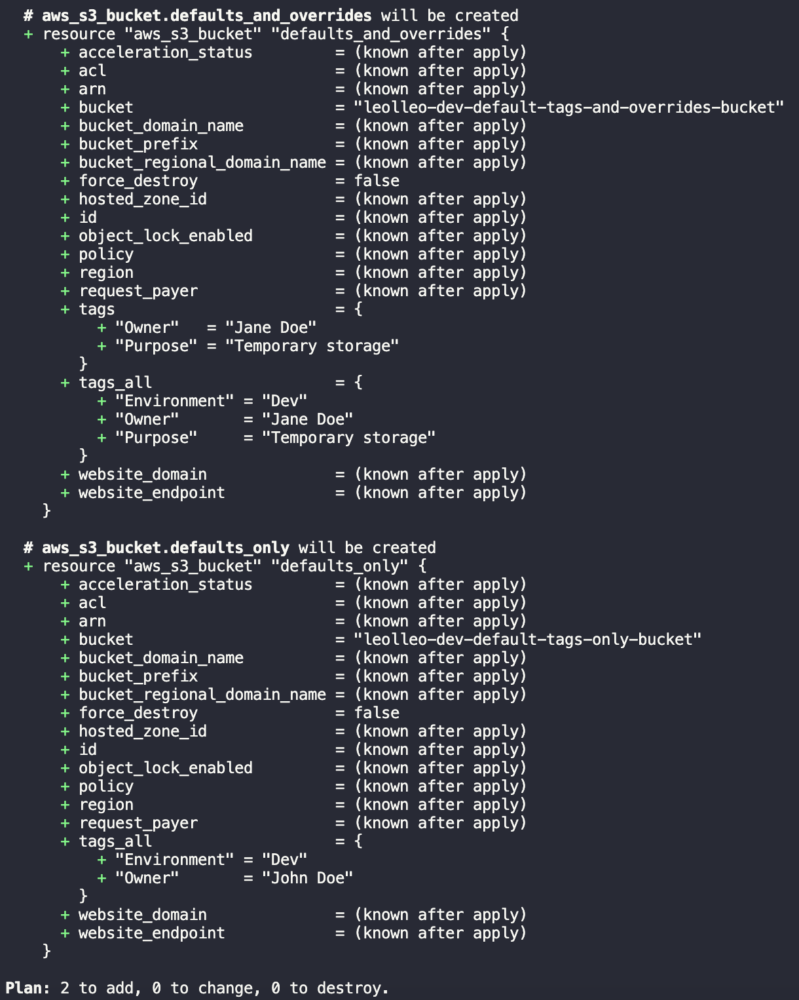

Tagging resources in AWS is a best practice to manage and organize your resources. Its official docs are extensive on how [one can achieve a good tagging strategy](https://docs.aws.amazon.com/whitepapers/latest/tagging-best-practices/tagging-best-practices.html). In a scenario where you're automating your infrastructure provisioning with Terraform, you can go a step further and easily manage your tags with the [AWS provider's default tags feature](https://www.hashicorp.com/blog/default-tags-in-the-terraform-aws-provider). This helps you achieve a consistent tagging strategy across your resources, improving your resource management and visibility.

## The default_tags block

The snippet below illustrates the concept. The tags `Environment = "Dev"` and `Owner = "John Doe"` are automatically applied to all resources created by the AWS provider for your current Terraform workspace, whilst you're still able to add specific tags per resource via their `tags` property.

```terraform
terraform {
  required_providers {
    aws = {
      source  = "hashicorp/aws"
      version = "~> 5.0"
    }
  }
}

provider "aws" {
  region = "eu-central-1"

  default_tags {
    tags = {
      Environment = "Dev"
      Owner       = "John Doe"
    }
  }
}

resource "aws_s3_bucket" "defaults_only" {
  bucket = "leolleo-dev-default-tags-only-bucket"
}

resource "aws_s3_bucket" "defaults_and_overrides" {
  bucket = "leolleo-dev-default-tags-and-overrides-bucket"

  tags = {
    Owner   = "Jane Doe"
    Purpose = "Temporary storage"
  }
}

```

By running `terraform plan` we get the output below. Notice how the default tags are applied to both buckets and overridden and extended in the second one (first in the picture).

[](terraform-plan.png)

After applying the plan, the below is how it looks like for both buckets tags on the AWS console.

[](aws-console-tags-defaults.png)
[](aws-console-tags-overriden-extra.png)

## Creating a terraform workspace back reference tag

A useful way to use the above is to attach a `TerraformWorkspace` tag to all your terraform AWS resources. This gives you the ability to quickly back reference any resource you see on your AWS account(s) back to the code/workspace that defines it, plus it helps in idenfifying which ones were created manually or by other means.

The workspace value is made available to your code through the [`terraform.workspace` named value](https://developer.hashicorp.com/terraform/language/expressions/references#terraform-workspace), which makes it possible to use it as `TerraformWorkspace = terraform.workspace` on the `default_tags` block.

This has the added benefit of making you able to filter resources by workspace in the AWS Management Console, CLI, or SDKs, and to use it as a [cost allocation tag](https://docs.aws.amazon.com/awsaccountbilling/latest/aboutv2/cost-alloc-tags.html), making you able to track your AWS costs by workspace.

## Conclusion

In this short post we've seen a simple yet powerful way to label your AWS resources with Terraform, making it easier to manage and track them. This is just one of many benefits one gets by leveraging infrastructure as code in general.

I hope you found this post useful and that it helps you in your journey. If you have any questions or suggestions, feel free to reach out in the comments below. Happy coding! 🚀
