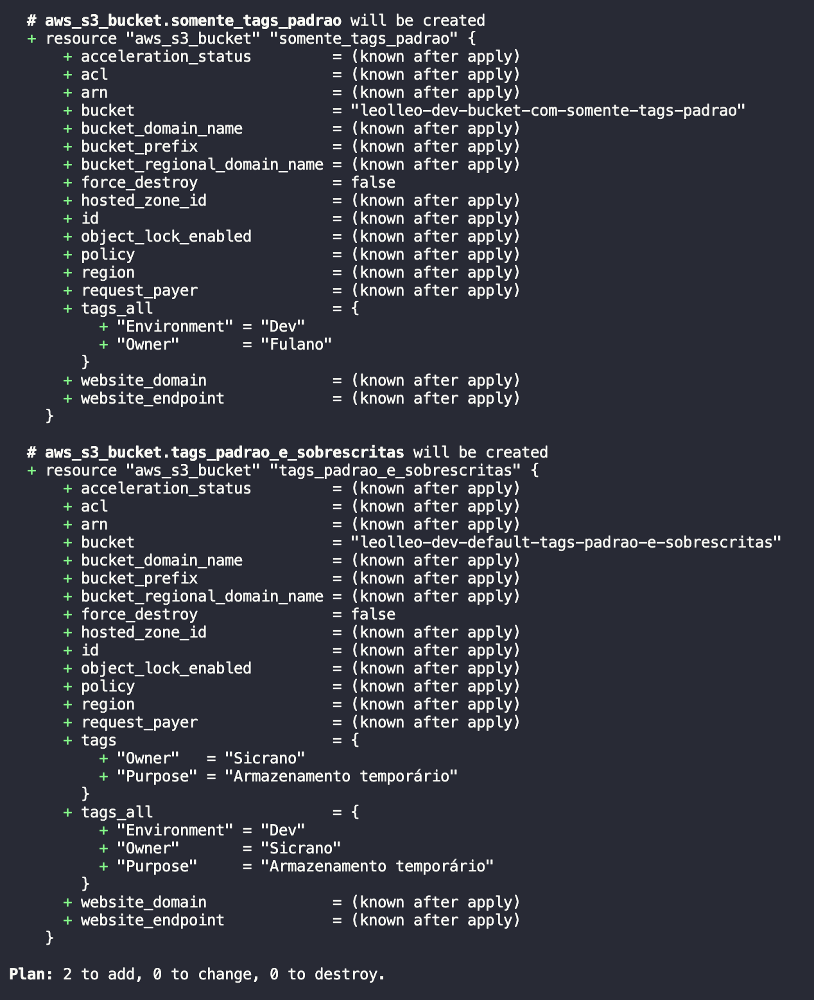
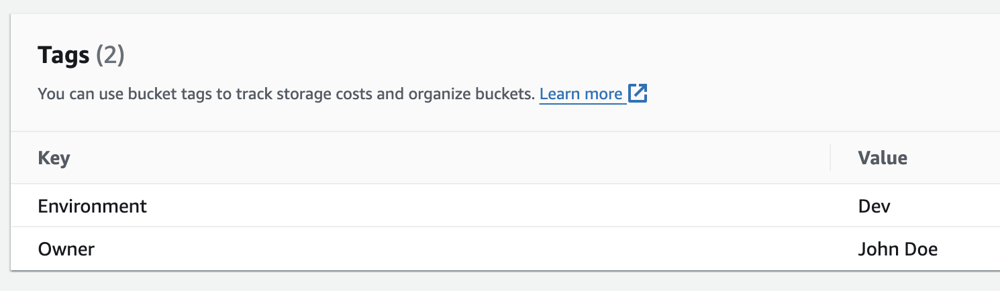
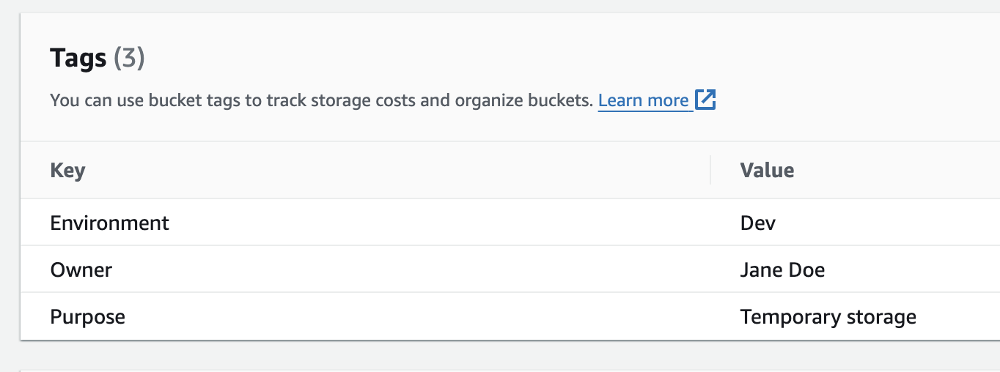

Rotular (a tradução da documentação oficial utiliza o termo marcar, para _tagging_) os seus recursos na AWS é uma prática recomendada para administrar e organizar os seus recursos. A documentação oficial é extensa sobre como [alcançar uma boa estratégia de marcação](https://docs.aws.amazon.com/pt_br/whitepapers/latest/tagging-best-practices/tagging-best-practices.html). Em um cenário onde você está automatizando o provisionamento da sua infraestrutura com o Terraform, você pode ir um passo além e gerenciar facilmente as suas _tags_ com o [recurso de _tags_ padrão do provider AWS](https://www.hashicorp.com/blog/default-tags-in-the-terraform-aws-provider). Isso ajuda você a alcançar uma estratégia de marcação consistente em todos os seus recursos, melhorando a sua administração e visibilidade dos recursos.

## O bloco default_tags

O trecho de código abaixo ilustra o conceito, onde as _tags_ `Environment = "Dev"` e `Owner = "John Doe"` são automaticamente aplicadas a todos os recursos criados pelo _provider_ AWS para o seu _workspace_ Terraform, ao mesmo tempo em que é possível adicionar _tags_ específicas por recurso através da propriedade `tags`.

```terraform
terraform {
  required_providers {
    aws = {
      source  = "hashicorp/aws"
      version = "~> 5.0"
    }
  }
}

provider "aws" {
  region = "eu-central-1"

  default_tags {
    tags = {
      Environment = "Dev"
      Owner       = "Fulano"
    }
  }
}

resource "aws_s3_bucket" "somente_tags_padrao" {
  bucket = "leolleo-dev-bucket-com-somente-tags-padrao"
}

resource "aws_s3_bucket" "tags_padrao_e_sobrescritas" {
  bucket = "leolleo-dev-default-tags-padrao-e-sobrescritas"

  tags = {
    Owner   = "Sicrano"
    Purpose = "Armazenamento temporário"
  }
}

```

Executando `terraform plan` obtemos a saída abaixo. Note como as _tags_ padrão são aplicadas a ambos os _buckets_ e sobrescritas e estendidas no segundo (primeiro na imagem).

[](terraform-plan.pt.png)

Após aplicar o plano, as imagens abaixo mostram como ficam as _tags_ de ambos os _buckets_ no console da AWS.

[](aws-console-tags-defaults.png)
[](aws-console-tags-overriden-extra.png)

## Criando uma tag de referência ao workspace do terraform

Uma maneira útil de utilizar o que foi mostrado acima é anexar uma tag `TerraformWorkspace` a todos os seus recursos AWS do terraform. Isso lhe dá a capacidade de referenciar rapidamente qualquer recurso que você veja na sua(s) conta(s) AWS de volta ao código/_workspace_ que o define, além de ajudar a identificar quais deles foram criados manualmente ou por outros meios.

O nome do _workspace_ é disponibilizado ao seu código através do [valor nomeado `terraform.workspace`](https://developer.hashicorp.com/terraform/language/expressions/references#terraform-workspace), o que torna possível utilizá-lo como `TerraformWorkspace = terraform.workspace` no bloco `default_tags`.

Isso tem o benefício adicional de torná-lo capaz de filtrar o seus recursos na AWS por _workspace_, seja no _Management Console_, CLI ou SDKs; e de utilizá-lo como uma [tag de alocação de custos](https://docs.aws.amazon.com/pt_br/awsaccountbilling/latest/aboutv2/custom-tags.html), permitindo que você rastreie os seus custos AWS por _workspace_.

## Conclusão

Neste pequeno post vimos uma maneira simples, porém poderosa, de rotular os seus recursos AWS com o Terraform, facilitando a sua administração e rastreamento. Este é apenas um dos muitos benefícios que se obtém da utilização da infraestrutura como código de um modo geral.

Espero que tenha achado este post útil e que ele lhe ajude na sua jornada. Se tiver alguma dúvida ou sugestão, sinta-se à vontade para entrar em contato nos comentários abaixo. Boa codificação! 🚀
